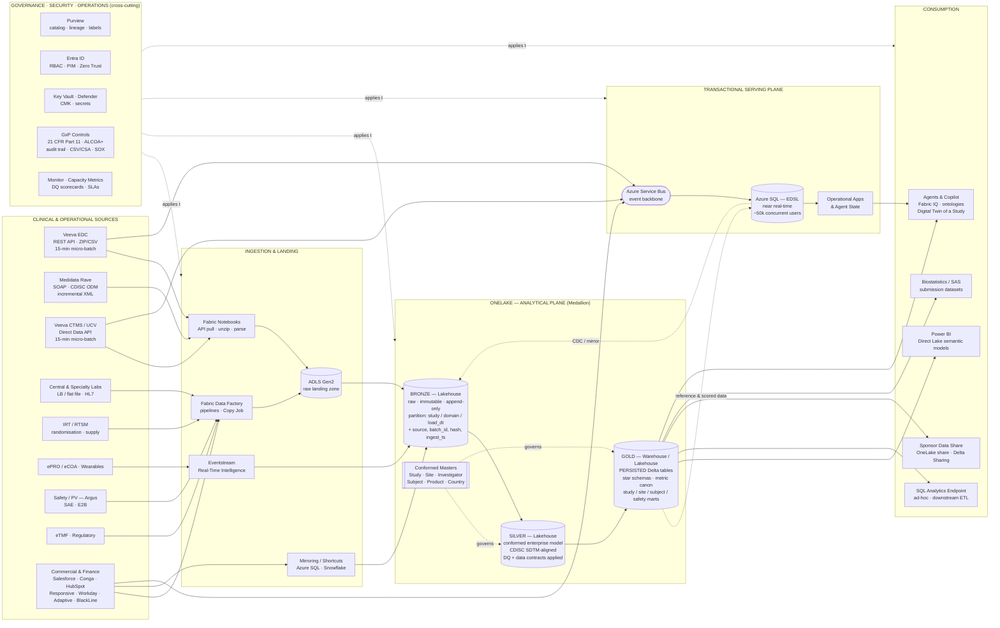
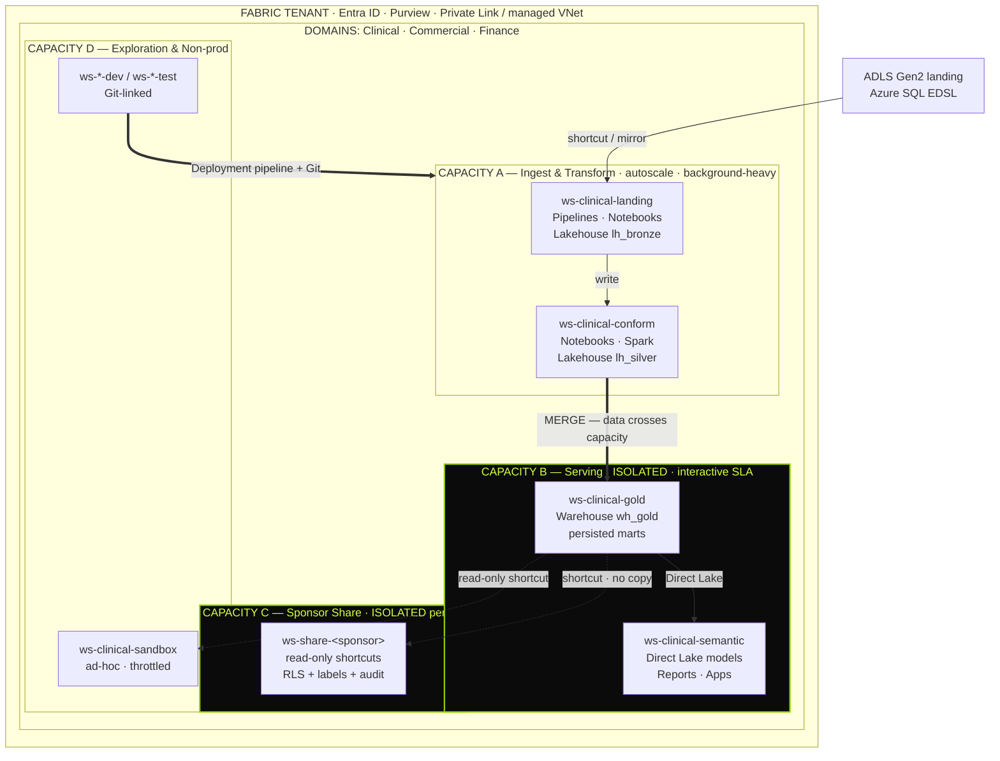
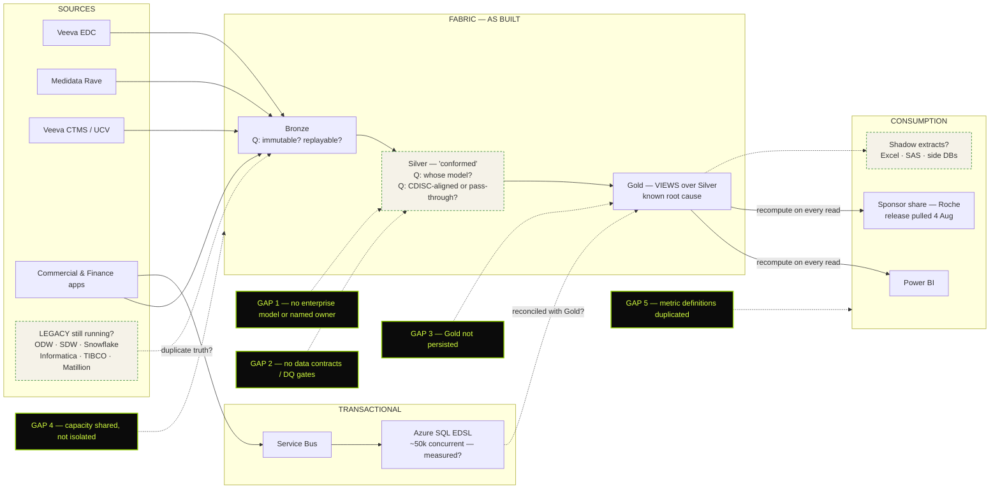
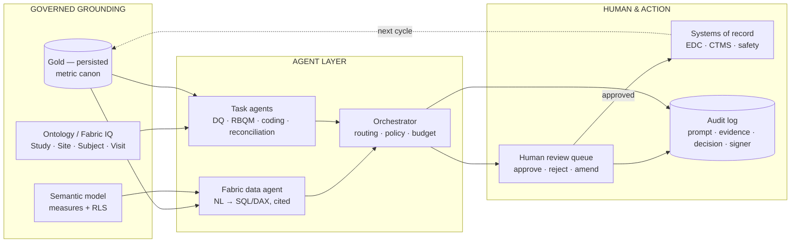

# End-to-End Microsoft Fabric Architecture — Clinical Data

Reference architecture and data-architect discovery question bank.
Framed against the current-state estate: Veeva EDC, Medidata Rave, Veeva CTMS/UCV, ADLS, Fabric medallion (Bronze → Silver → Gold), Azure SQL EDSL serving plane, Azure Service Bus.

---

## 1. End-to-end architecture



### Layer contract (what each layer is allowed to do)

| Layer | Purpose | Persistence | Owner | Non-negotiables |
|---|---|---|---|---|
| Landing (ADLS) | Byte-faithful copy of source payload | Files, immutable, TTL'd | Platform Eng | No transformation. Checksum + manifest per batch. |
| Bronze | Typed raw, append-only history | Delta, partitioned, never overwritten | Platform Eng | Full lineage columns; replayable; no business rules. |
| Silver | Conformed enterprise clinical model | Delta, MERGE/SCD2 | Data Architecture | CDISC-aligned; contracts enforced; DQ gates block promotion. |
| Gold | Consumption-ready marts and metrics | **Persisted Delta tables, not views** | Domain / Product owner | One metric definition; SLA'd refresh; no chained recompute. |
| EDSL (Azure SQL) | Transactional / low-latency serving | Relational, OLTP-tuned | App Engineering | Not a reporting warehouse; no analytical fan-out. |

> The Roche incident is the design constraint here: Gold-as-views forced every downstream read to recompute the full Silver chain, which exhausted Fabric capacity under sponsor-facing load. Gold must be materialised, incrementally maintained, and capacity-tested at sponsor concurrency.

### Reference flow — a single subject's data

```mermaid
sequenceDiagram
  autonumber
  participant S as Veeva EDC / Rave
  participant N as Fabric Notebook / Pipeline
  participant A as ADLS Landing
  participant B as Bronze Delta
  participant V as Silver (SDTM-aligned)
  participant G as Gold (persisted)
  participant C as Power BI / Sponsor Share

  S->>N: Incremental extract (15-min window / ODM delta)
  N->>A: Write payload + manifest (batch_id, checksum, row count)
  N->>B: Parse → typed Delta append (study, site, subject, form, item)
  B->>B: Reconciliation: source count vs landed count
  B->>V: Conform → SDTM domains (DM, SV, AE, LB, EX, VS)
  V->>V: DQ gates — key integrity, controlled terminology, freshness
  alt DQ gate fails
    V-->>N: Quarantine + alert; promotion blocked
  else DQ gate passes
    V->>G: Incremental MERGE into persisted marts
    G->>C: Direct Lake refresh / sponsor share publish
  end
  C->>C: Audit event written (who, what, when — Part 11)
```

---

## 1A. Physical Fabric topology (target)

The logical medallion says nothing about isolation. This view is the one that prevents the next capacity incident — sponsor-facing reads must not share a capacity with transformation.



**Decisions this view forces:**

- Which workloads share a capacity, and what the throttling blast radius is.
- Shortcut versus copy at every boundary — a shortcut means the *reader's* capacity pays the compute.
- Whether sponsor shares are per-sponsor workspaces or RLS on a shared object. (Per-sponsor workspace is the defensible answer for confidentiality.)
- Whether exploration and ad-hoc SQL can starve sponsor-facing reads.
- Environment promotion path and what is Git-backed.

---

## 1B. Current state, as-built — with gap overlay

Use this in the workshop, not the target-state diagram. Solid = evidenced. Dashed = asserted but unevidenced. `?` = open question to capture live.



---

## 2. Data-architect question bank

Use one row per source, per object, per decision. Any question that cannot be answered in the room becomes an evidence request with a **named owner and a date**.

### 2.1 Sources and acquisition

1. For each source, what is the authoritative extract mechanism today — API, adapter, file drop, database read — and is it vendor-supported or custom-built?
2. Is extraction full or incremental? If incremental, what is the watermark (modified timestamp, ODM `TransactionType`, sequence number), and what happens when it moves backwards?
3. What is the actual observed latency versus the stated 15-minute micro-batch, and where is that measured?
4. How are hard deletes and record retractions in EDC/Rave detected and propagated? Or are deletes invisible downstream?
5. How is EDC data reconciled against the source count — row-level, subject-level, or not at all?
6. What happens to an in-flight batch when the API rate-limits, returns partial data, or times out mid-ZIP? Is the batch atomic?
7. Are source schemas versioned? What is the process when a sponsor adds a CRF field or a study uses a non-standard form?
8. Which studies are onboarded to which source, and is there a single registry of study → source → pattern?
9. For Rave ODM: is the ODM export clinical-data-only, or does it carry metadata (`Study`, `MetaDataVersion`)? How are `ItemDef`/codelist changes handled?
10. Which sources are still on legacy (ODW, SDW, Snowflake, Informatica, TIBCO, Matillion) and what is the decommission date for each?
11. Where do values disagree today between legacy and Fabric, and which one is declared authoritative?
12. Are lab, IRT, ePRO, imaging and safety feeds in scope? If not now, what is the intended pattern for each?

### 2.2 Landing and Bronze

13. Is the landing zone immutable and replayable? Can you reprocess a specific study from a specific date without touching the source?
14. What is the physical partitioning strategy in Bronze — by study, domain, load date, or a mix? What is the average file size and small-file count?
15. What lineage metadata is written on every row (source system, batch id, file name, ingest timestamp, payload hash, extract watermark)?
16. Is Bronze append-only, or is it overwritten/merged? If merged, where is the original raw fidelity preserved for audit?
17. What is the retention policy for landing and Bronze, and does it satisfy trial master file and regulatory retention obligations?
18. How is PII/PHI handled at landing — is it encrypted, tokenised, or landed in the clear and secured by access control only?
19. What is the OPTIMIZE / VACUUM / Z-ORDER maintenance schedule, and who owns it?

### 2.3 Silver — the conformed model

20. **Is there an enterprise clinical data model in Silver, and who authored it?** Is it documented, versioned, and reviewed?
21. Is Silver aligned to CDISC SDTM, a proprietary conformed model, or effectively a per-source pass-through?
22. Where does the sponsor-agnostic, cross-study view exist — Silver or Gold? Can you answer "all AEs across all studies for a compound" without per-study code?
23. What are the conformed master entities (Study, Site, Investigator, Subject, Product, Country, Visit), where do they master, and who arbitrates conflicts?
24. Is subject identity resolved across EDC, CTMS, lab and IRT? What is the survivorship rule when identifiers disagree?
25. Are controlled terminologies (CDISC CT, MedDRA, WHODrug, LOINC, SNOMED) applied in Silver? Which version, and how is a version uplift handled retrospectively?
26. Is slowly-changing history preserved (SCD2) for site, investigator and subject status, or is only the current state kept?
27. Are there **data contracts** between producers and Silver — schema, nullability, key uniqueness, allowed values, freshness SLA? Are they enforced or documentary?
28. What happens on contract violation — fail the pipeline, quarantine the rows, or log and continue?
29. Is transformation logic in notebooks, dataflows, stored procs, or spread across all three? Is it in source control?
30. Is Silver idempotent? If the same batch is replayed twice, do you get duplicates?

### 2.4 Gold and consumption

31. **Which Gold objects are views today, and which are persisted tables?** Produce the inventory.
32. For each Gold object: who consumes it, at what concurrency, with what freshness SLA, and who is the named owner?
33. What is the incremental refresh strategy for persisted Gold — full rebuild, MERGE, or partition swap? What is the rebuild cost?
34. Is Gold modelled as star schemas, wide flat tables, or one-off extracts per consumer?
35. **Is there a metric canon?** How many places define "enrolled subject", "screen failure", "data entry lag", "query ageing", "site activation"? Which one wins?
36. Are Power BI semantic models on Direct Lake, Import or DirectQuery? Where does fallback to DirectQuery occur, and has it been measured?
37. Is the same metric recomputed in Gold, in the semantic model, and in report-level DAX? Where should it live?
38. How many "shadow" datasets and Excel extracts exist downstream of Gold, and what do they compensate for?
39. What is the sponsor data-share mechanism — OneLake share, Delta Sharing, SFTP extract, API? What is the isolation guarantee between sponsors?
40. How is a sponsor-facing release tested for load before it is published?

### 2.5 Transactional serving plane (EDSL)

41. What workloads run on Azure SQL EDSL and why were they not placed on the analytical plane? What is the explicit boundary rule?
42. What is the real concurrency and read/write profile behind the ~50,000 concurrent users figure? Is it measured or estimated?
43. Is EDSL fed only from Service Bus, or also from Fabric? Is there a bidirectional path, and can the two planes disagree?
44. What is the consistency contract between Gold and EDSL — eventual, and with what bounded staleness?
45. How is agent and application state persisted — in EDSL, in Cosmos DB, in the lakehouse? What is the intended target?
46. What is the Service Bus delivery guarantee, dead-letter handling and replay procedure? Who monitors the DLQ?
47. Is EDSL data included in lineage and catalog, or is it an ungoverned island?

### 2.6 Orchestration, reliability and operations

48. What orchestrates the estate — Fabric pipelines, ADF, a scheduler, or ad-hoc notebook triggers? Is there a single control plane?
49. Is there true dependency-based orchestration, or time-based scheduling with implicit ordering assumptions?
50. What is the retry, backfill and catch-up strategy after an outage? Has it been rehearsed?
51. What are the defined SLAs and SLOs per pipeline, and where are breaches visible?
52. Who is on call for a failed clinical data load at 02:00, and what is the escalation path?
53. What is the RPO/RTO for Bronze, Silver, Gold and EDSL? Has restore been tested, not just backed up?
54. Is there a runbook for a poisoned load — bad data promoted to Gold and consumed by a sponsor?

### 2.7 Capacity, performance and cost

55. What Fabric capacity SKU(s) are in use, how are workspaces bound to them, and which workloads share a capacity?
56. Is there capacity isolation between ingestion, transformation, sponsor-facing reads and ad-hoc exploration? Or does one noisy job take everyone down?
57. What is the current capacity utilisation profile — peak, sustained, throttling and smoothing events over the last 90 days?
58. Which jobs are the top capacity consumers, and is that list reviewed?
59. What is the cost per study, per sponsor, per workstream? Can cost be attributed at all?
60. What is the plan when a large study or a new sponsor doubles volume — scale the SKU, or re-architect?

### 2.8 Data quality, lineage and catalog

61. What DQ dimensions are measured (completeness, validity, uniqueness, timeliness, referential integrity, cross-source consistency), and at which layer?
62. Are DQ checks blocking gates or passive reports?
63. Is there a DQ scorecard visible to business owners, and is anyone accountable for the trend?
64. Is end-to-end lineage available from a Power BI visual back to the source CRF field? Is it automated or hand-drawn?
65. Is Purview deployed, scanning, and actually used — or catalogued once and abandoned?
66. Are business glossary terms mapped to physical columns? Who approves a term?
67. How would you perform an impact analysis before changing a Silver column today?

### 2.9 Security, privacy and access

68. What is the workspace and domain topology in Fabric, and what is the tenancy/isolation model per sponsor and per study?
69. How is access granted — Entra groups, Fabric workspace roles, OneLake data access roles, SQL permissions? Is it consistent?
70. Is row-level and column-level security implemented for study, site, country and sponsor scoping? Where is it enforced — semantic model only, or in the lake?
71. How is PHI identified, labelled and masked? Are sensitivity labels applied and enforced downstream?
72. What is the de-identification / pseudonymisation strategy for secondary use and AI training?
73. Are customer-managed keys required? Where is private networking (Private Link, managed VNet) mandated?
74. How is privileged access controlled (PIM, just-in-time), and are production writes possible by individuals?
75. How are cross-border transfer and data residency constraints handled per study and per country?

### 2.10 Regulatory, GxP and validation

76. Which parts of this estate are GxP-relevant, and where is the documented system classification and risk assessment?
77. How is 21 CFR Part 11 satisfied — audit trails, record integrity, e-signatures, time-stamping — on lakehouse objects?
78. Are ALCOA+ principles demonstrable for data that passes through Bronze → Silver → Gold?
79. What is the CSV/CSA approach for Fabric artefacts, and how does it coexist with continuous deployment?
80. How is a change to a transformation validated, approved and evidenced before it reaches a submission dataset?
81. Can you reconstruct the exact dataset delivered to a sponsor on a given date, and prove it? (Delta time travel retention vs. audit requirement.)
82. What is the SOX scope on the finance path, and is segregation of duties enforced?
83. How are inspection and audit requests serviced today, and how long does one take?

### 2.11 Environments, CI/CD and change

84. What environments exist (dev/test/prod), and are they true isolated capacities and workspaces?
85. Is Fabric Git integration and deployment pipelines in use, or are changes made directly in production workspaces?
86. How are parameters and connections promoted between environments?
87. Is there automated testing — unit tests on transforms, regression tests on metric outputs?
88. What is the change advisory process for a schema change in Silver, and what is the consumer notification mechanism?
89. How is technical debt tracked, and who funds its remediation?

### 2.12 Intelligence and agent readiness

90. Which Gold objects are considered agent-consumable today, and what makes them so?
91. Is there an ontology or semantic layer (Fabric IQ, OneLake catalog, semantic models) that agents can reason over, or will each agent embed its own logic?
92. Where does agent memory and conversation state live, and is it in scope for GxP and PHI controls?
93. How will agent outputs be grounded, cited and audited back to Gold objects?
94. What is the human-in-the-loop and approval model for any agent action that touches clinical data?
95. What is the "Digital Twin of a Study" made of concretely — which entities, which relationships, which source of truth?

### 2.13 Ownership and operating model

96. Who is the named owner of the enterprise data model? Of each domain? Of each Gold object?
97. Is there a data architecture review board, and does it have authority to block a design?
98. Which decisions can a delivery team make alone, and which require architecture sign-off?
99. What is the intake process for a new source, a new study, or a new sponsor?
100. What decision, made without an enterprise model or a named owner, is most likely to cause the next Roche-class incident?

---

## 3. Evidence to request in the room

| # | Artefact | Why it matters | Owner | Date |
|---|---|---|---|---|
| 01 | Gold object inventory — view vs. persisted, consumer, SLA | Root of the capacity incident | | |
| 02 | Silver conformed model — ERD, CDISC mapping, version history | Determines whether an enterprise model exists | | |
| 03 | Source → pattern → frequency → owner register | Baseline for the estate walk | | |
| 04 | Fabric capacity metrics — 90 days, peak/throttle/smoothing | Separates capacity cause from design cause | | |
| 05 | Data contracts and DQ gate definitions | Shows whether quality is enforced or observed | | |
| 06 | Lineage export (Purview) from report to source field | Impact analysis feasibility | | |
| 07 | Access model — workspace roles, RLS/CLS, sponsor isolation | Sponsor confidentiality | | |
| 08 | GxP classification, Part 11 controls, validation package | Regulatory exposure | | |
| 09 | EDSL workload profile and concurrency measurement | Validates the two-plane split | | |
| 10 | Legacy decommission plan with dates and dependencies | Migration residue and duplicate truth | | |

---

## 4. Design positions to land

1. **Gold is persisted, never a view chain.** Incremental MERGE, partitioned, load-tested at sponsor concurrency.
2. **Two planes, one truth.** Gold for analytics; Azure SQL / EDSL for transactional and agent state. The boundary is written down and enforced.
3. **Conformed masters and a metric canon are the first data workstream.** Nothing else is trustworthy without them.
4. **Contracts at every layer boundary,** enforced as blocking gates, not dashboards.
5. **Capacity isolation** between ingestion, transformation and sponsor-facing reads.
6. **One named owner per Gold object and per domain,** with authority and a date.

---

# Part B — Understanding the business problem

Section 2 interrogates the *estate*. This section interrogates the *problem*. Run this **first**. If you open with technical questions you will get a technical answer to a question nobody funded.

## 5. The one technique that matters

**Work backwards from decisions, not forwards from data.**

Do not ask "what data quality issues do you have?" — you will get a list of symptoms nobody owns. Ask instead:

> *"Walk me through a decision in the last quarter that was made late, made twice, or made wrong — and tell me what you would have needed to know."*

Then trace that decision back through the consumer, the report, the Gold object, the Silver transform, and the source. That single trace produces a defensible business case, a technical root cause and a named owner in one pass. Do it three times with three different roles and you have the workshop.

## 6. Business discovery question set

### 6.1 The outcome at stake

1. What is the business trying to achieve in the next 12–18 months that this data must support? Growth, margin, sponsor retention, cycle-time reduction, inspection readiness?
2. If this programme succeeds completely, what is measurably different — and who notices first?
3. Whose objectives is this on? Is there a named executive whose bonus or board commitment depends on the outcome?
4. What does the CRO's competitive position depend on — speed to database lock, sponsor-facing transparency, cost per subject, something else?
5. Is this a *cost* problem, a *trust* problem, a *speed* problem, or a *risk* problem? Which one would the CEO name first?

### 6.2 Where the pain actually shows up

6. Who complains about data, in what forum, and how often does it reach the executive level?
7. Which teams have hired people specifically to work around data problems? What are those roles actually doing?
8. What is the single most common question you cannot answer quickly today?
9. How long does it take to answer "how is study X actually tracking?" — and how many people touch that answer?
10. Where does the same number get produced twice with two different values? Who adjudicates?
11. What breaks at month-end, at database lock, at interim analysis, at an inspection?
12. Which recurring meeting exists mainly to reconcile numbers? What would happen if you cancelled it?

### 6.3 Decision inventory — do this live

13. Name the ten decisions that most depend on clinical and operational data. For each: who decides, on what cadence, using which artefact?
14. For each decision — what is the cost of being wrong, and what is the cost of being late?
15. Which of those decisions are currently made on gut feel because the data is not trusted or not timely?
16. Which decisions are deferred entirely because nobody can assemble the evidence?
17. When a decision turns out to be wrong, how do you find out — and how long does that take?

### 6.4 Sponsor and contractual exposure

18. What is contractually committed to sponsors on data delivery — content, frequency, quality, format, latency?
19. Have you missed a contracted data commitment in the last 12 months? How many times, and what was the consequence?
20. What did the Roche release incident cost — in remediation effort, in relationship, in the next contract negotiation?
21. Are there penalty clauses, credits, or at-risk fees tied to data delivery or quality?
22. Has a sponsor ever audited your data pipeline? What did they find?
23. Would a prospective sponsor's due diligence on your data platform help you win or hurt you? Has that been tested in a bid?
24. What proportion of new business requires data-transparency commitments you cannot currently make?

### 6.5 Regulatory, quality and risk exposure

25. Have you had an inspection or audit finding related to data integrity, traceability or system validation? What was it?
26. How long does it currently take to respond to an inspector asking "show me how this value was derived"?
27. Can you reproduce the exact dataset delivered to a sponsor on a given date, and prove it?
28. What is the worst-case regulatory scenario this programme is intended to prevent, and how likely is it today?
29. Where does the quality organisation believe the largest data-integrity risk sits, and does IT agree?
30. Is there a CAPA open today that this programme would close?

### 6.6 Cost of poor data quality — quantify it

31. How many FTEs across the organisation spend material time reconciling, re-keying, or manually assembling data? What is that in cost?
32. What is the rework cost when a data issue is found late versus early?
33. How much duplicate licensing and infrastructure is retained because legacy platforms cannot yet be switched off?
34. What is the current Fabric capacity spend, and what proportion is consumed by avoidable recompute?
35. What is the cost of a delayed database lock, expressed in days and in currency?
36. What revenue is at risk from sponsor dissatisfaction traceable to data delivery?
37. If this programme is not funded, what is the 24-month trajectory of these costs?

### 6.7 Workarounds and shadow work

38. How many Excel files, Access databases, SAS extracts or personal Power BI models are load-bearing today?
39. What does each shadow artefact compensate for? Which platform gap does it name?
40. Who maintains them, and what happens when that person leaves or is on holiday?
41. Which of these have made it into a sponsor deliverable or a regulatory submission?

### 6.8 What "good" looks like

42. Twelve months from now, what would make you say this worked? Be specific enough to measure.
43. What is the target — time to trusted answer, first-pass data acceptance rate, cost per study, reconciliation effort, inspection response time?
44. What is the current baseline for each of those, and is it measured or estimated?
45. Which single metric, if it moved, would prove the programme's value to the board?
46. What would you be willing to stop doing if the platform worked?

### 6.9 Ownership, funding and change readiness

47. Who owns data quality today — a role, a team, or nobody? Do they have authority or only responsibility?
48. Is there a data governance function? What has it actually changed in the last year?
49. Who can approve a decision that constrains a delivery team's autonomy?
50. Is funding secured, contested, or hypothetical? Which budget line?
51. What competing initiatives are drawing on the same people?
52. Which previous attempt at this failed, and why? What must be different this time?
53. What is the organisation's tolerance for changing how study teams work, not just how the platform works?

### 6.10 Why now

54. What is the forcing function — a sponsor commitment, an audit, a renewal, a cost target, an AI ambition?
55. What is the date by which something must be demonstrably different, and what happens if it is not?
56. What happens if you do nothing for another year?

## 7. Quantification worksheet

Fill this in the room. A business case with three defensible rows beats one with twenty estimated rows.

| Impact area | Current baseline | Source of figure | Target | Annual value | Confidence |
|---|---|---|---|---|---|
| Reconciliation effort (FTE) | | | | | H / M / L |
| Rework from late-found data issues | | | | | |
| Missed sponsor data commitments (count) | | | | | |
| Roche-class incident — cost and recurrence risk | | | | | |
| Time to trusted answer (days) | | | | | |
| Duplicate legacy licensing and infra | | | | | |
| Avoidable Fabric capacity consumption | | | | | |
| Database-lock cycle time | | | | | |
| Audit / inspection response effort | | | | | |
| Revenue at risk from data-driven dissatisfaction | | | | | |

Mark every figure **measured**, **estimated by owner**, or **assumed by us**. Do not blend them.

## 8. Facilitation notes

- **Sequence:** business problem (§6) → decision trace (§5) → estate walk (§2) → design positions (§4). Not the reverse.
- **One voice at a time on decisions.** Ask "who decides" before "what is decided" — the pause is the finding.
- **Blank cells are the output.** Every unanswered question leaves with a named owner and a date, per the Canvas 01 pattern.
- **Separate symptom from cause.** "Fabric capacity was exceeded" is a symptom. "Gold was built as views" is a cause. "No enterprise model and no named owner" is the class of cause. Push to the third level.
- **Do not present hypotheses as findings.** Only the Gold-as-views issue is evidenced. Everything else on the gap canvas is a test to run.
- **Guard the estimate caveat.** Any cost figure shown must carry the line that it requires validation with Fortrea Finance before use in a commitment.

---

# Part C — The flow in detail, stage by stage

## 9. Stage map

| # | Stage | Question it answers | Physical artefact | Owner | Consumers allowed |
|---|---|---|---|---|---|
| 0 | Source systems | What was recorded, by whom, when? | Vault / Rave / CTMS databases | Clinical systems | None directly |
| 1 | Extract &amp; land | Did we receive it faithfully and completely? | ADLS files + manifest | Platform Eng | None |
| 2 | Bronze | Can we replay history exactly? | `lh_bronze` Delta, append-only | Platform Eng | Engineers only |
| 3 | Silver | What does it mean, in one shared language? | `lh_silver` Delta, conformed | Data Architecture | Engineers, biostat (controlled) |
| 4 | Gold | What is the answer, agreed and fast? | `wh_gold` persisted tables | Domain owner | Everyone |
| 5 | Serving | Who can see it, and how quickly? | Semantic models, shares | BI / Product | Business, sponsors |
| 6 | Transactional | What does the app need right now? | Azure SQL EDSL | App Eng | Applications, agents |
| 7 | Agents | What should someone do about it? | Grounded agents + actions | AI Platform | Humans, with approval |

**The consumption rule:** nothing outside engineering reads below Gold. Every exception is a governance failure with a name attached to it. If biostatistics needs Silver, that is a designed, contracted, audited path — not a convenience.

---

## 10. Stage 0 — What the source systems actually hold

You cannot design conformance without knowing the shape of what arrives. The three clinical sources are structurally different, and that difference is the entire reason Silver must exist.

### Veeva EDC (Vault)

| Aspect | Detail |
|---|---|
| Model | Study → Casebook → Event (visit) → Form (CRF) → ItemGroup → Item |
| Also carries | Queries, protocol deviations, SDV/SDR status, form lifecycle states, signatures |
| Access | Vault Clinical Data API (REST) or scheduled ZIP of CSV extracts |
| Observed pattern | ZIP of CSVs, unpacked by Fabric notebooks into ADLS, 15-minute cadence |
| Incremental key | Vault `modified_date__v` / extract watermark |
| Trap | Study design differs per study. A "form" in Study A is not a "form" in Study B. Column sets vary. |

### Medidata Rave

| Aspect | Detail |
|---|---|
| Model | CDISC ODM XML: `ClinicalData → SubjectData → StudyEventData → FormData → ItemGroupData → ItemData` |
| Metadata | `Study → MetaDataVersion → StudyEventDef, FormDef, ItemGroupDef, ItemDef, CodeList` |
| Access | Rave Web Services (SOAP), Clinical Views, ODM adapter |
| Incremental key | ODM `TransactionType` — `Insert`, `Update`, `Remove`, `Upsert`, `Context` |
| Audit | `AuditRecord` elements carry user, datetime, reason for change |
| Trap | **`TransactionType=Remove` is a real deletion.** If you ignore it, your lake keeps data the source has retracted. That is a data-integrity finding, not a bug. |

### Veeva CTMS / UCV

| Aspect | Detail |
|---|---|
| Model | Study → Country → Site → Investigator / Coordinator; monitoring visits, milestones, enrolment actuals |
| Access | Direct Data API — high-volume incremental, files per time window |
| Cadence | 15-minute windows |
| Value | This is the **operational** truth: who is running the site, when it activated, what the monitoring burden is |
| Trap | Site and investigator identity here must reconcile to EDC's site references. They frequently do not. |

### Why this forces a conformed model

A sponsor asks: *"How many subjects have had a serious adverse event across my three studies?"* Study 1 is on Veeva EDC, Study 2 on Rave, Study 3 on Rave with a different `MetaDataVersion`. Without Silver, that question is three bespoke queries written by three people who will disagree. With Silver, it is one query against `slv_ae`.

**That single sentence is the business case for the enterprise model.**

---

## 11. Stage 1 — Extract and land

**Purpose:** obtain a byte-faithful, provably complete copy. Nothing else.

### The sequence, per batch

1. **Acquire credentials** from Key Vault via workspace managed identity. Never a stored secret in a notebook.
2. **Read the watermark** from a control table — `ctl_extract_watermark(source, study_id, last_success_ts, last_success_batch)`.
3. **Open a batch** — generate `batch_id` (ULID), write a `RUNNING` row to `ctl_batch`.
4. **Call the source**, honouring pagination and rate limits, with bounded retry and exponential backoff.
5. **Write payload** to the landing path, unmodified:
   ```
   /landing/{source}/{study_id}/{yyyy}/{mm}/{dd}/{batch_id}/
       _manifest.json          # counts, checksums, watermark range, API response codes
       subjects.csv | odm.xml | events.parquet ...
   ```
6. **Compute checksums** per file and a batch-level row count.
7. **Reconcile** — the count the source *said* it was sending versus what landed. Mismatch means the batch fails; it does not partially promote.
8. **Close the batch** — `SUCCESS` or `FAILED`, and only on `SUCCESS` advance the watermark.

### Controls that matter here

- **Atomicity.** A batch is all-or-nothing. Half a ZIP is not data.
- **Idempotency.** Re-running `batch_id` must not duplicate. The batch folder is the idempotency key.
- **Immutability.** Landing is write-once. Never edited, never cleaned. It is the evidence that you received what you received — the *Original* in ALCOA+.
- **Watermark safety.** If the source's modified timestamp moves backwards (clock skew, restated records), you need overlap windows and dedupe on `_row_hash`, not blind trust.

### Failure modes and what to do

| Failure | Wrong response | Right response |
|---|---|---|
| API rate limit mid-extract | Retry the whole day | Backoff, resume from page cursor, same `batch_id` |
| Partial ZIP | Load what arrived | Fail batch, do not advance watermark, alert |
| Source returns 0 rows | Assume no changes | Distinguish "no changes" from "extract broken" — alert on unexpected zero |
| Schema changed silently | Pipeline crashes at Silver | Detect at land, quarantine, notify contract owner |

---

## 12. Stage 2 — Bronze

**Purpose:** typed, queryable, append-only history. Still no business meaning.

### What happens

1. Parse landed payload into Delta — Rave ODM XML shredded into tabular; Veeva CSV typed.
2. **Append only.** Never `UPDATE`, never `DELETE`, never `OVERWRITE`. An "update" in the source is a new row in Bronze with a later `_ingest_ts`.
3. Stamp every row with lineage:

   | Column | Purpose |
   |---|---|
   | `_source_system` | `veeva_edc` / `rave` / `ucv` |
   | `_batch_id` | Ties row to landing folder and control table |
   | `_file_name` | Which physical file |
   | `_ingest_ts` | When we landed it |
   | `_source_modified_ts` | When the source says it changed |
   | `_transaction_type` | Rave: Insert/Update/Remove |
   | `_row_hash` | Dedupe and change detection |
   | `_payload_hash` | File-level integrity proof |

4. Partition physically: `study_id` / `load_date`. Compact small files on a schedule — 15-minute micro-batches across hundreds of studies produce a small-file problem within weeks if nobody owns `OPTIMIZE`.

### Why append-only is non-negotiable

Regulators ask: *"What did you believe on 14 March, and what do you believe now, and why did it change?"* An overwritten Bronze cannot answer that. Delta time travel helps but its retention is a configuration, not a guarantee — the append-only pattern is the guarantee.

### The deletion problem, handled

Rave `TransactionType=Remove` arrives as a **new Bronze row** flagged as a retraction. Bronze still holds the original *and* the retraction. Silver interprets the pair and excludes the record from current state. Nothing is ever physically destroyed in Bronze.

---

## 13. Stage 3 — Silver, the conformed clinical model

This is where the estate either becomes an asset or stays a collection of pipelines. Six things happen, in order.

### 13.1 Normalise structure

Rave ODM's nested XML and Veeva's flat CSVs are reshaped into the same tabular grain. Rave `ItemData` (key-value: one row per field) must be pivoted to entity-per-row; Veeva is already close.

### 13.2 Map to the canonical model

Target: **SDTM-aligned domains**, because they are the industry's shared vocabulary and the route to submission-readiness.

| Domain | Content | Fed by |
|---|---|---|
| `DM` | Demographics — one row per subject | EDC / Rave |
| `SV` | Subject visits — actual visit dates | EDC / Rave |
| `AE` | Adverse events | EDC / Rave, reconciled to safety DB |
| `LB` | Laboratory results | Central lab feeds |
| `VS` | Vital signs | EDC / Rave |
| `EX` | Exposure — dosing | EDC / IRT |
| `CM` | Concomitant medications | EDC / Rave |
| `MH` | Medical history | EDC / Rave |
| `DS` | Disposition — completion, withdrawal | EDC / Rave |
| `QS` | Questionnaires | ePRO / eCOA |

Plus **operational** entities SDTM does not cover — `slv_site`, `slv_investigator`, `slv_monitoring_visit`, `slv_query`, `slv_protocol_deviation`, `slv_milestone`. These come from CTMS/UCV and are where most of the *business* value sits for a CRO.

> Do not force operational data into SDTM. SDTM is for clinical data destined for analysis and submission. Operational data needs its own conformed model, designed deliberately.

### 13.3 Apply controlled terminology

| Vocabulary | Applied to | Version discipline |
|---|---|---|
| CDISC CT | SDTM variables | Pinned per study; uplift is a project |
| MedDRA | Adverse events, medical history | Version-stamped on the row; re-coding on uplift is a controlled event |
| WHODrug | Concomitant medications | Same |
| LOINC | Lab tests | Enables cross-lab harmonisation |

**Critical:** stamp the dictionary version on every coded row. When MedDRA moves from 27.0 to 27.1 and a term is reclassified, you must be able to state which version produced which result. Without it, an inspector's question is unanswerable.

### 13.4 Resolve master data

The conformed masters — `Study`, `Site`, `Investigator`, `Subject`, `Country`, `Product`.

Subject identity is the hard one. The same human appears as:
- `USUBJID` in EDC
- a randomisation number in IRT
- an accession identifier at the lab
- a case ID in safety

Silver must carry a **crosswalk** with an explicit survivorship rule and a confidence flag, plus an exception queue for unresolved matches. Unresolved does not mean silently dropped — it means quarantined and visible.

Dimensions carry **SCD2** history. "Which investigator was responsible when this AE occurred?" is a real question with a real answer only if you kept the history.

### 13.5 Enforce data contracts — as blocking gates

A contract per producer → Silver boundary:

```yaml
contract: veeva_edc.subject_visit
version: 3
owner: clinical-data-architecture
schema:
  usubjid:    { type: string, nullable: false }
  visit_num:  { type: int,    nullable: false }
  visit_date: { type: date,   nullable: true  }
keys:
  primary: [study_id, usubjid, visit_num]
  unique:  true
referential:
  usubjid -> slv_subject.usubjid
freshness:
  max_lag_minutes: 30
volume:
  expected_daily_rows: { min: 1000, max: 250000 }
on_violation: quarantine_and_block
```

`on_violation: quarantine_and_block` is the whole point. A contract that logs a warning and lets bad data through is documentation, not control. **This is the difference between the current estate and the target estate.**

### 13.6 Run DQ gates

| Dimension | Example check | On failure |
|---|---|---|
| Completeness | Every enrolled subject has a `DM` row | Block |
| Validity | AE severity is in the codelist | Quarantine row |
| Uniqueness | No duplicate `study_id + usubjid + visit_num` | Block |
| Timeliness | Data no older than SLA | Alert, allow |
| Referential | Every AE ties to a real subject and site | Block |
| Cross-source | EDC SAE count reconciles to safety DB | Alert + exception queue |
| Plausibility | Visit date not before consent date | Quarantine row |

Quarantined rows go to `slv_quarantine` with the failed rule, the payload, and the batch — visible, ageing, owned. Not deleted, not silently skipped.

---

## 14. Stage 4 — Gold

**Purpose:** the answer, agreed once, served fast. This is where the Roche incident was caused and where it is fixed.

### 14.1 Persisted, always

Gold objects are **materialised Delta tables maintained by incremental `MERGE`**. Not views. Not chained views. The read cost is paid once at write time, by the transformation capacity — not repeatedly at read time, by whichever sponsor happens to open a report.

```
Views over Silver:  read cost = O(full Silver chain) x every reader x every read
Persisted Gold:     read cost = O(scan of one table);  write cost = O(delta) x once
```

Under sponsor-facing concurrency the first collapses. That is exactly what happened on 4 August.

### 14.2 Star schema

**Facts** — `fct_enrolment_daily`, `fct_subject_visit`, `fct_adverse_event`, `fct_query_lifecycle`, `fct_data_entry_lag`, `fct_site_activation`, `fct_protocol_deviation`, `fct_monitoring_visit`.

**Dimensions** — `dim_study`, `dim_site`, `dim_subject`, `dim_investigator`, `dim_visit`, `dim_form`, `dim_date`, `dim_sponsor`, `dim_country`.

### 14.3 The metric canon

One definition, one place, versioned, owned.

| Metric | Definition | Owner |
|---|---|---|
| Enrolled subject | First dose administered, per `EX`, excluding screen failures | Clinical Ops |
| Screen failure rate | Screened not randomised ÷ screened, per protocol version | Clinical Ops |
| Data entry lag | `form_entered_ts − visit_date`, business days | Data Management |
| Query ageing | Days open, banded 0–7 / 8–14 / 15–30 / 30+ | Data Management |
| Site activation cycle | Contract executed → first subject screened | Clinical Ops |
| SDV burden | Fields requiring verification ÷ fields entered | Data Management |

Publish it. Make report authors reference it rather than re-derive it in DAX. **The number of places "enrolled subject" is defined today is one of the sharpest diagnostic questions in Part B.**

### 14.4 Incremental maintenance

```
Changed keys in Silver since last watermark
  → stage the delta
  → MERGE into fct_* on business key
  → update dimension SCD2
  → refresh affected partitions only
  → run post-load reconciliation (Gold totals vs Silver totals)
  → publish a completion event
```

Full rebuilds are a disaster-recovery procedure, not a daily operation.

### 14.5 Sponsor scoping

Sponsor confidentiality is a **structural** boundary, not a filter. Each sponsor's data is projected into a per-sponsor workspace with read-only shortcuts. A bug in a WHERE clause should not be able to cross a sponsor boundary — the architecture, not the code, should make it impossible.

---

## 15. Stage 5 — Serving, and how the data must be used

| Consumer | Path | Latency | Rule |
|---|---|---|---|
| Study teams | Direct Lake semantic model → Power BI | Near real-time | No report-level metric redefinition |
| Sponsors | Per-sponsor workspace, shortcut to scoped Gold | Contractual | Load-tested before publish |
| Biostatistics | Governed export Silver/Gold → ADaM → SAS | Per lock schedule | Versioned, reproducible, signed |
| Commercial / finance | Direct Lake semantic model | Daily | SOX controls on the finance path |
| Applications | Azure SQL EDSL | Sub-second | Not the analytical plane |
| Agents | Fabric data agent over Gold + semantic model | Near real-time | Read-only, cited, audited |
| Regulators | Evidence pack assembled from Gold + lineage | On demand | Reproducible to a date |

### Direct Lake, specifically

Direct Lake reads Delta directly — no import refresh, no DirectQuery translation. But it **falls back to DirectQuery** when a model exceeds guardrails or hits unsupported constructs, and fallback is where performance silently dies. Monitor fallback explicitly. It is a top-five cause of "the report got slow and nobody knows why."

### The rule nobody enforces and everybody needs

**A metric is defined once, in Gold.** The semantic model exposes it. Reports consume it. A report author writing new business logic in DAX is creating a fifth version of the truth. Governance is not a document about this — it is a review that blocks it.

---

## 16. Stage 6 — The transactional plane

Different problem, different tool.

```
Source app event → Azure Service Bus (topic) → consumer → Azure SQL EDSL → application
```

**Why it exists separately:** an application needing a single subject's status in 50 ms, at 50,000 concurrent sessions, is an OLTP workload. A lakehouse is the wrong shape for it. Forcing it onto Fabric produces exactly the capacity contention that pulled the Roche release.

**The boundary rule, written down:**

| Belongs on the analytical plane | Belongs on EDSL |
|---|---|
| Aggregation, trend, cohort, cross-study | Single-record lookup |
| Anything a human explores | Anything an app requires synchronously |
| Anything a sponsor receives as a dataset | Application and agent working state |
| Anything feeding a submission | Transactional writes |

**Reconciliation** between the two planes is a designed control, not an assumption. EDSL changes flow back to Bronze via CDC or mirroring, so the analytical plane can prove the two agree — and raise an exception when they do not.

**Service Bus discipline:** at-least-once delivery means consumers must be idempotent. Dead-letter queues need a named owner, an ageing dashboard, and a rehearsed replay procedure. An unmonitored DLQ is silent data loss.

---

## 17. Stage 7 — Agents: what they do, what they must not do

### 17.1 The grounding rule

Agents read **Gold and the semantic model**. Never Bronze, never Silver, never source APIs.

Why: Gold is the only layer that is defined, owned, versioned and quality-gated. An agent grounded on Silver will confidently produce a number that disagrees with the report next to it — and you will have manufactured a new class of trust problem at machine speed.



### 17.2 The autonomy boundary — the GxP line

**Agents propose. Humans dispose. Every time.**

| Permitted | Forbidden |
|---|---|
| Read governed data | Write to clinical data of record |
| Detect, rank, summarise, explain | Close a query without human approval |
| Draft a query, a narrative, a coding suggestion | Alter a coded term autonomously |
| Route work, flag risk, forecast | Sign anything |
| Cite evidence | Assert a number it cannot cite |

Any agent output that reaches a system of record passes a **named human** who approves it under their own identity, with the agent's evidence attached. That approval is the Part 11 e-signature event. The audit record captures: prompt, retrieved evidence with object versions, model and version, output, reviewer, decision, timestamp.

### 17.3 The agent portfolio

| Agent | Trigger | Reads | Produces | Human checkpoint | Value |
|---|---|---|---|---|---|
| **Data Quality / Query Triage** | New data lands in Gold | `fct_subject_visit`, `fct_query_lifecycle`, DQ results | Ranked anomalies + drafted site queries | DM approves before query issues to site | Cuts manual review; queries raised in hours not the next monitoring cycle |
| **Cross-source Reconciliation** | Scheduled + on load | `AE` vs safety DB, `EX` vs IRT, `LB` vs lab feed | Discrepancy list with proposed resolution | DM adjudicates | Finds SAE mismatches before they become inspection findings |
| **RBQM / Site Risk** | Daily | KRIs from `fct_*`, site dimension | Site risk scores, outlier patterns, QTL breaches | CRA lead decides monitoring action | Targets monitoring where risk is; reduces unnecessary on-site visits |
| **Medical Coding Assist** | Uncoded term appears | `AE`, `CM`, MedDRA/WHODrug | Ranked coding suggestions with rationale | Coder accepts or overrides | Reduces coding backlog; consistency across studies |
| **Protocol Deviation Detection** | On visit data load | Protocol rules + `SV`, `EX`, `VS` | Candidate deviations with evidence | Study lead confirms | Earlier detection, fewer late-surfacing deviations at lock |
| **Enrolment Forecast** | Weekly | `fct_enrolment_daily`, site activation, history | Projections + at-risk studies | Ops reviews | Earlier intervention on recruitment shortfall |
| **Sponsor Response** | Sponsor question | Sponsor-scoped Gold only | Cited answer within the sponsor's boundary | Optional review by tier | Deflects ad-hoc requests; faster sponsor answers |
| **Start My Day** | User opens Teams | Role-scoped Gold + tasks | Prioritised brief for that person's studies | N/A — read-only | Removes the daily assembly of status from five reports |
| **Document Intelligence** | Protocol / TMF upload | Documents + ontology | Extracted structured attributes | Reviewer confirms | Turns protocol text into queryable structure |
| **Database Lock Readiness** | On demand + scheduled | Open queries, deviations, coding backlog, DQ exceptions | Readiness scorecard + blocking list | Study team works the list | Compresses lock cycle time; the metric a sponsor actually feels |

### 17.4 The two agent shapes

**Fabric data agent** — natural language over your lakehouse, warehouse and semantic models. Configure with instructions and example queries so it uses the metric canon rather than inventing SQL. Best for: *"what is the number?"*

**Task agents** (Azure AI Foundry, surfaced in Teams / M365 Copilot / custom apps) — event-triggered, multi-step, tool-calling, with memory. Best for: *"what should we do about it?"*

Both go through one orchestrator that owns routing, policy, cost budget and the audit trail. Ten agents with ten independent grounding strategies is the shadow-Excel problem rebuilt in AI.

### 17.5 Why agents only work after Stages 3 and 4

An agent on today's estate would ground on view-based Gold with no metric canon, no conformed model and no contracts. It would be fast, fluent and wrong — and it would carry the authority of the platform while being wrong.

**Sequence is not negotiable:** conformed model → persisted Gold → metric canon → agents. Attempting agents first is the most expensive way to discover you needed the data foundation.

---

## 18. Worked example — one adverse event, end to end

A site coordinator records a serious AE at **09:14** on a Tuesday.

| Time | Stage | What happens |
|---|---|---|
| 09:14 | Source | Recorded in Veeva EDC. Vault stamps user, timestamp, reason. |
| 09:15 | — | AE sits in Vault. Nothing downstream knows. |
| 09:30 | **Stage 1** | 15-minute extract opens `batch_id`, pulls records modified since 09:15, lands ZIP + manifest to ADLS. Row counts reconcile. Watermark advances. |
| 09:32 | **Stage 2** | Notebook parses CSV → appends to `brz_edc_ae` with `_batch_id`, `_ingest_ts`, `_row_hash`. Nothing interpreted. |
| 09:34 | **Stage 3** | Conformed into `slv_ae`. `USUBJID` resolved via crosswalk. Site and investigator joined from SCD2 dimensions *as at the AE date*. MedDRA coding flagged pending — dictionary version stamped. **DQ gates:** subject exists ✓, AE onset ≥ consent date ✓, seriousness in codelist ✓. Passes. |
| 09:36 | **Stage 3** | **Cross-source check:** this SAE has no matching case in the safety database. Does not block — raises an exception into the reconciliation queue. |
| 09:38 | **Stage 4** | Incremental `MERGE` into `fct_adverse_event`. Aggregates for site, study and sponsor refresh on affected partitions only. Post-load reconciliation confirms Gold totals match Silver. |
| 09:39 | **Stage 5** | Direct Lake semantic model reframes. The study safety report is current. No import refresh, no view recompute. |
| 09:40 | **Stage 7** | **Reconciliation agent** picks up the exception, drafts: *"SAE recorded in EDC for subject X on <date>, no corresponding safety case within the 24-hour expectation. Proposed action: raise safety reconciliation query."* Cites the Gold row and its version. |
| 09:41 | **Stage 7** | **RBQM agent** notes this is the third SAE at this site in 14 days against a study average of 0.4. Raises the site risk score. Flags to the CRA lead. |
| 09:42 | Human | Data Manager opens the review queue, sees the drafted query with evidence, approves it. Signed under her identity. Audit record written. |
| 09:43 | Action | Query issues to the site through the EDC integration. Safety team notified. |
| Next cycle | Loop | Site response flows back through Stages 1–4. Query ageing updates in `fct_query_lifecycle`. The loop closes. |

**Under today's architecture,** the same event surfaces whenever someone next opens a report that recomputes the full Silver chain — assuming capacity is available — and the safety reconciliation gap is found by a human at the next scheduled reconciliation, potentially weeks later.

**That contrast is the demo.** Twenty-nine minutes from a coordinator's keystroke to a signed, evidenced action — versus a reconciliation cycle. It is worth more in the room than any architecture slide.

---

## 19. Failure, replay and audit

### Replay

Because landing is immutable and Bronze is append-only, any downstream layer can be rebuilt from evidence you already hold:

```
Reprocess study S from date D
  → read /landing/{source}/{S}/{D}/**  (untouched originals)
  → rebuild Bronze partitions for S, D
  → re-run Silver conformance (deterministic, versioned code)
  → MERGE affected Gold partitions
  → reconcile and publish
```

No source re-extraction. No dependency on a vendor API still holding the history. This is what makes the platform inspectable.

### Audit posture per stage

| Stage | ALCOA+ contribution |
|---|---|
| Landing | **Original** — untouched received payload with checksum |
| Bronze | **Enduring, Complete** — append-only, nothing lost |
| Silver | **Accurate, Consistent** — contracts, gates, versioned dictionaries |
| Gold | **Available** — the answer, reproducible to a date via time travel |
| Agents | **Attributable, Contemporaneous** — every action carries prompt, evidence, model version, human signer, timestamp |

### The inspector's question, answered

*"Show me how this value was derived."*

Gold row → Gold table version → Silver transform code version in Git → Silver row → Bronze row → `_batch_id` → landing folder → manifest with checksum → source API response. Every hop is a stored, queryable fact. Today, that chain is assembled by hand, if it can be assembled at all.

---

## 20. How each stage pays for itself

| Stage | Mechanism | Where it shows up |
|---|---|---|
| 1–2 | Replayable evidence | Audit response drops from weeks to hours; no re-extraction from vendors |
| 3 | One conformed model | Cross-study questions answered once, not per study; new study onboarding becomes configuration |
| 3 | Blocking contracts | Issues caught at the boundary, not at database lock, where rework is an order of magnitude more expensive |
| 4 | Persisted Gold | Capacity consumption falls; sponsor-facing reads stop competing with ETL; no repeat of 4 August |
| 4 | Metric canon | Reconciliation meetings stop existing |
| 5 | Governed serving | Shadow Excel estate loses its reason to exist |
| 6 | Correct plane separation | Applications get sub-second reads without threatening analytics |
| 7 | Agents | Human effort moves from *finding* problems to *deciding* about them |

**The compounding argument:** every stage makes the next one cheaper. Agents on a conformed, contracted, persisted foundation are a small increment. Agents without it are a rebuild.

---

# Part D — Session 01 run-sheet · Wed 26 Aug 2026 · 120 min

**Kickoff, data estate &amp; architecture**

**Exit criteria:** full source inventory captured and labelled · architecture understood · use case candidates surfaced · evidence pack issued.

## 21. The running order, and what to have on screen

| # | Min | Segment | Owner | Diagram page | This doc |
|---|---|---|---|---|---|
| 1 | 10 | Welcome, scope, definition of done | Tim Newton | — | §21.3 |
| 2 | 25 | **The data estate — every source** | **Deepak Balan** | 03 · CURRENT | §22 |
| 3 | 25 | Current architecture as built — EDL, CEDL, medallion, EDSL | Son Ly | 03 · CURRENT | §23, §25, §26 |
| 4 | 20 | **Ingestion patterns &amp; Gold-view incident** | **Deepak Balan** | 03 · CURRENT | §24, §27 |
| 5 | 10 | Target architecture | Rajesh Singh | 01 · TARGET | §28 |
| 6 | 30 | Business use case — candidates | Willie Ahlers | 04 · TRANSITION | §28.2 |

> **You own segments 2 and 4 — 45 of the 120 minutes.** Sections §22, §24 and §27 are your prep. Everything else is listening and capture.

### 21.1 Three risks in this running order

1. **Segments 2 and 3 are 50 consecutive minutes of inventory and architecture.** That is where overrun happens, and the thing it eats is segment 6 — the only segment that establishes what any of this is worth. Protect segment 6 explicitly at the start, or move it earlier.
2. **Target architecture gets 10 minutes.** That is one diagram, not four. Give Rajesh page 01 · TARGET only. Page 02 · Physical Topology is a follow-up artefact — attempting it in 10 minutes will produce a capacity debate that consumes segment 6.
3. **Business use case is last and longest, when energy is lowest.** If the room is flagging at minute 90, take the break before segment 6, not before segment 5.

### 21.2 Capture discipline — from the deck footer

> *Label every inventory line **Tool-scanned** or **Workshop-captured** as it is captured. Assign a treatment or a named open question to every object before moving on.*

This is the single most important instruction on the slide. It means:

- **Provenance on every row.** Tool-scanned is evidence. Workshop-captured is testimony. They are not the same and must never be merged into one undifferentiated inventory.
- **No row leaves without a disposition.** Either a treatment, or a named open question with an owner and a date. A row with neither is a row you will re-discover in session 04.

**Treatment vocabulary — agree these before the session so capture is fast:**

| Treatment | Meaning |
|---|---|
| `KEEP` | Stays as-is, no action |
| `REPLATFORM` | Moves to Fabric |
| `RETIRE` | Decommission, date required |
| `CONSOLIDATE` | Merges into another object or tool |
| `INVESTIGATE` | Named open question, owner + date required |

### 21.3 Segment 1 — what to listen for while Tim restates the ask

You are not speaking, but this is the segment that tells you whether the rest lands. Note:

- Does Fortrea's restatement of the ask mention **data trust**, or only **platform consolidation**? That determines whether segment 6 has anywhere to go.
- Does anyone name an owner for the outcome?
- Is "definition of done" expressed as artefacts, or as a business change?

If the ask comes back as pure technology, segment 6 becomes the most important 30 minutes of the day and you should say so when you hand over.

### 21.4 Evidence pack — issue it in the room

"Evidence pack issued" is in the exit criteria, so it must leave with the session, not follow it.

| # | Artefact | Sized by | Owner | Date |
|---|---|---|---|---|
| 01 | Gold object inventory — view vs persisted, consumer, owner | Seg 3, 4 | | |
| 02 | Silver / CEDL model documentation + version history | Seg 3 | | |
| 03 | Source register — pattern, frequency, pipeline owner | Seg 2 | | |
| 04 | Capacity Metrics export, 60 days | Seg 3 | | |
| 05 | Roche release record — sequence, patch, what changed in design | Seg 4 | | |
| 06 | Third-party tool contracts and renewal dates | Seg 2 | | |
| 07 | Manual data entry register — where, which system of record | Seg 2 | | |
| 08 | Workspace and capacity assignment list | Seg 3 | | |

---

## 22. Segment 02 · 25 min · The data estate — every source · **Deepak Balan**

**Objective:** a complete, labelled source inventory across Commercial, Finance and Clinical. This is an exit criterion — it must be finished.

**On screen:** page 03 · CURRENT · Gap Overlay, plus the live inventory sheet. Blank the hypotheses panel — it belongs to segment 4.

**The arithmetic, and why it matters:** 25 minutes across three domains and potentially 20+ sources is roughly **60 seconds per source**. You cannot discover the inventory in the room. Pre-populate every row you can from the tool scan and use the room only for the blanks and the disagreements.

**Opening move:** *"We have pre-filled what the scan found. We are going to go domain by domain, and I want you to correct us and fill the gaps. Every line gets a label and a treatment before we move on."*

### Capture template

| Source | Domain | In Fabric / legacy only | Pattern | Frequency | Pipeline owner | Provenance | Treatment | Open question · owner · date |
|---|---|---|---|---|---|---|---|---|
| Veeva EDC | Clinical | | batch | 15 min | | Workshop | | |
| Medidata Rave | Clinical | | batch | | | | | |
| Veeva CTMS / UCV | Clinical | | batch | 15 min | | | | |
| Salesforce | Commercial | | | | | | | |
| Workday | Finance | | | | | | | |
| … | | | | | | | | |

Provenance is `Tool-scanned` or `Workshop-captured`. Treatment is from the §21.2 vocabulary.

### Questions

| # | Question | Ref |
|---|---|---|
| 1 | Which sources are in Fabric today, and which are still only in the legacy estate? | deck |
| 2 | For each source: batch or streaming, what frequency, and who owns the pipeline? | deck |
| 3 | **Which third-party tools are still paid for that Fabric could subsume?** Renewal dates? | deck |
| 4 | **Where does manual data entry still occur, and in which system of record?** | deck |
| 5 | What is still on legacy — ODW, SDW, Snowflake, Informatica, TIBCO, Matillion — and what is the decommission date for each? | 2.1 · 10 |
| 6 | Where do values disagree between legacy and Fabric today, and which is authoritative? | 2.1 · 11 |
| 7 | Are labs, IRT/RTSM, ePRO, imaging and safety in scope? If not now, what is the intended pattern? | 2.1 · 12 |
| 8 | Is there a single registry of study → source → pattern, or is this it? | 2.1 · 8 |

> **Landmine:** Q4. Manual data entry is where data quality is manufactured, and it is almost never on an architecture diagram. Every manual entry point is simultaneously a quality risk, an automation candidate for segment 6, and a control gap for GxP. Ask it in every domain, not once.

**Second landmine:** Q6. *"Who decides which one wins?"* If nobody arbitrates, you have found the operating-model gap in your own segment and handed segment 5 its motivation.

**Q3 is your gift to segment 6.** Third-party spend that Fabric could subsume is the cleanest, least contestable line in a business case. Capture contract names and renewal dates, not impressions.

**Move on when:** every row has a provenance label and a treatment or a named open question. Not when every cell is full — blank cells with an owner against them are a valid outcome.

---

## 23. Segment 03 · 25 min · Current architecture as built — EDL, CEDL, medallion, EDSL · **Son Ly**

**Objective:** establish whether an enterprise model exists, or whether "conformed" means "landed". You are listening and capturing here, not driving — but these are the questions to put in.

**On screen:** page 03 · CURRENT.

**Opening question to put to Son:** *"Help us understand the split between EDL and CEDL. Is that a physical separation, a domain boundary, or a naming convention?"*

| # | Question | Ref |
|---|---|---|
| 5 | Is EDL / CEDL separation physical, logical, or naming? Separate workspaces, capacities, lakehouses? | new |
| 6 | Is there one medallion or several — per source, per domain, per study? | new |
| 7 | **Who authored the Silver model, and when was it last reviewed?** | 2.3 · 20 |
| 8 | Is Silver aligned to CDISC SDTM, a proprietary conformed model, or effectively per-source pass-through? | 2.3 · 21 |
| 9 | Can you answer "all AEs across all studies for a compound" without per-study code? Where does that query run? | 2.3 · 22 |
| 10 | What are the conformed masters, where do they master, and who arbitrates conflicts? | 2.3 · 23 |
| 11 | Is subject identity resolved across EDC, CTMS, lab and IRT? What is the survivorship rule? | 2.3 · 24 |
| 12 | Are MedDRA / WHODrug / CDISC CT versions stamped on coded rows? How is an uplift handled retrospectively? | 2.3 · 25 |
| 13 | Is SCD2 history kept for site, investigator and subject status — or only current state? | 2.3 · 26 |

> **Landmine:** Q7. Ask for a name, not a team. If the answer is "it evolved" or "various people over time", you have confirmed H1 and the rest of the session is about consequences.

**Evidence to request:** CEDL / Silver ERD, CDISC mapping document, version history, the crosswalk logic for subject identity.

---

## 24. Segment 04a · ~8 min · Ingestion patterns and failure modes · **Deepak Balan**

**Objective:** determine whether ingestion is replayable and atomic, or best-effort. Then pivot to the incident.

**On screen:** page 03 · CURRENT, ingestion band.

**Opening move:** *"Walk us through one batch, end to end — a Veeva EDC 15-minute window. What happens from API call to Bronze row?"*

**Budget discipline:** you have 20 minutes for both halves. Failure modes gets 8, the Roche release gets 12. The incident is the more valuable half — do not let the ingestion detail consume it.

| # | Question | Ref |
|---|---|---|
| 14 | Full or incremental? What is the watermark, and what happens when it moves backwards? | 2.1 · 2 |
| 15 | What is the observed latency versus the stated 15 minutes, and where is that measured? | 2.1 · 3 |
| 16 | **How are hard deletes and retractions detected — specifically Rave `TransactionType=Remove`?** | 2.1 · 4 |
| 17 | Is a batch atomic? What happens on rate limit, partial ZIP, or timeout mid-extract? | 2.1 · 6 |
| 18 | Is there row-level reconciliation between source count and landed count? | 2.1 · 5 |
| 19 | Is landing immutable and replayable? Can you reprocess study X from date D without touching the source? | 2.2 · 13 |
| 20 | What lineage metadata is stamped on every Bronze row? | 2.2 · 15 |
| 21 | Is Bronze append-only, or merged/overwritten? Where is raw fidelity preserved? | 2.2 · 16 |
| 22 | Is Silver idempotent? Replay the same batch twice — do you get duplicates? | 2.3 · 30 |
| 23 | Are there data contracts? On violation — block, quarantine, or log and continue? | 2.3 · 27–28 |
| 24 | Is transformation logic in source control, and is it in notebooks, dataflows, procs, or all three? | 2.3 · 29 |

> **Landmine:** Q16. If Rave `Remove` is not handled, the lake retains records the source has retracted. That is a data-integrity exposure, not a backlog item — and it is verifiable in minutes, so it lands as a finding rather than a hypothesis.

**Second landmine:** Q23. *"Show us a load that failed a contract last month."* If none exist, either the data is perfect or nothing is enforced.

**At 8 minutes, pivot:** *"That is the pattern. Now let us look at what happened when it met sponsor-facing load."*

---

## 25. Segment 03 (cont.) · Silver / Gold implementation and serving · **Son Ly**

**Objective:** confirm the Gold persistence position and count the metric definitions. Highest-value questions in Son's segment.

**On screen:** page 03 · CURRENT — the Gold box is already marked as evidenced.

**Opening move:** *"We would like to go through the Gold object inventory. Which are views today and which are persisted?"* Have it on screen if it arrived; if it did not, that absence is your first evidence request.

| # | Question | Ref |
|---|---|---|
| 25 | **Which Gold objects are views, which are persisted tables?** Object by object. | 2.4 · 31 |
| 26 | For each: consumer, concurrency, freshness SLA, named owner | 2.4 · 32 |
| 27 | For persisted objects — full rebuild, MERGE, or partition swap? What does a rebuild cost? | 2.4 · 33 |
| 28 | Is Gold modelled as star schemas, wide flat tables, or per-consumer extracts? | 2.4 · 34 |
| 29 | **How many places define "enrolled subject"?** Count them out loud. | 2.4 · 35 |
| 30 | Direct Lake, Import or DirectQuery? Where does fallback to DirectQuery occur, and is it monitored? | 2.4 · 36 |
| 31 | Is the same metric computed in Gold, in the semantic model, and in report DAX? | 2.4 · 37 |
| 32 | How many shadow datasets and Excel extracts sit downstream, and what do they compensate for? | 2.4 · 38 |
| 33 | Sponsor share mechanism — and what is the isolation guarantee between sponsors? | 2.4 · 39 |
| 34 | How is a sponsor-facing release load-tested before publication? | 2.4 · 40 |

> **Landmine:** Q29. Ask it as a counting exercise and let the room answer over each other. The disagreement in the room *is* the demonstration. You will not need to argue for the metric canon after this.

**Q34 is the one that connects to 4 August.** If the answer is "it isn't", segment 6 writes itself.

---

## 26. Segment 03 (cont.) · Capacity, performance and scalability · **Son Ly**

**Objective:** separate capacity-as-cause from capacity-as-symptom, using data on screen.

**On screen:** Fabric Capacity Metrics app, live.

**Opening move:** *"Can we open the Capacity Metrics app and look at the last 60 days together?"*

> If nobody in the room can open Capacity Metrics live, capture it as evidence request 04 and move immediately. Twenty minutes of capacity discussion from memory produces nothing, and segment 6 needs the time more.

| # | Question | Ref |
|---|---|---|
| 35 | Which SKUs are in use, how are workspaces bound, and which workloads share a capacity? | 2.7 · 55 |
| 36 | **Is there isolation between ingestion, transformation, sponsor-facing reads and ad-hoc exploration?** | 2.7 · 56 |
| 37 | Show peak, sustained, throttling and smoothing events over 60 days | 2.7 · 57 |
| 38 | Which jobs are the top capacity consumers? Is that list reviewed, and by whom? | 2.7 · 58 |
| 39 | What is the cost per study, per sponsor, per workstream? Can cost be attributed at all? | 2.7 · 59 |
| 40 | When a large study or new sponsor doubles volume — scale the SKU or re-architect? | 2.7 · 60 |
| 41 | What proportion of consumption is avoidable recompute from view chains? | new |

> **Landmine:** Q36, asked while looking at the metrics. If ETL and sponsor reads share a capacity, point at the throttling events and ask *"which workload caused this one?"* If they cannot tell, that is the observability finding and the isolation argument in a single exchange.

**Q41 is your business case.** Avoidable recompute expressed as a percentage of capacity spend is the number that funds H0.

---

## 27. Segment 04b · ~12 min · The Gold-view incident · **Deepak Balan**

**Objective:** get the room to say that the remediation was tactical and the design decision remains. Not a post-mortem, and not about who did what.

**On screen:** page 03 · CURRENT — Roche box, hypotheses panel now revealed.

**Opening move:** *"Take us through the Roche release sequence, minute by minute. Who noticed, how, and what happened next?"*

**Structure the 12 minutes as:** 5 min sequence → 4 min what was changed → 3 min where else it applies.

| # | Question | Ref |
|---|---|---|
| 42 | Who noticed the incident first — monitoring, or the sponsor? | new |
| 43 | **What changed after the patch — design, test coverage, or only capacity?** | Canvas 02 · 05 |
| 44 | Where else does the same pattern exist, unmeasured? | Canvas 02 · 04 |
| 45 | What orchestrates the estate — one control plane, or time-based scheduling with implicit ordering? | 2.6 · 48–49 |
| 46 | What is the retry, backfill and catch-up strategy after an outage? Has it been rehearsed? | 2.6 · 50 |
| 47 | What SLAs exist per pipeline, and where are breaches visible? | 2.6 · 51 |
| 48 | Who is on call for a failed clinical load at 02:00, and what is the escalation path? | 2.6 · 52 |
| 49 | RPO / RTO for Bronze, Silver, Gold, EDSL — and has restore been *tested*, not just configured? | 2.6 · 53 |
| 50 | Is there a runbook for bad data promoted to Gold and consumed by a sponsor? | 2.6 · 54 |
| 51 | Are DQ checks blocking gates or passive reports? Is there a scorecard anyone is accountable for? | 2.8 · 62–63 |
| 52 | Could you perform impact analysis before changing a Silver column today? How? | 2.8 · 67 |

> **Landmine:** Q42. If the sponsor noticed before monitoring did, observability is the finding — independent of the capacity question. That is a sentence an executive understands immediately.

**Q43 is the crux of the whole engagement.** Your Canvas 02 already frames it: the remediation was tactical, the design decision remains. Get them to say it.

---

## 28. Segment 05 · 10 min · Target architecture · **Rajesh Singh**

**Objective:** show where this is heading. Ten minutes is one diagram and three sentences — not a design review.

**On screen:** page 01 · TARGET · L0 Context. **Only that page.**

> Do not put page 02 · Physical Topology on screen here. Capacity SKUs and workspace topology will start a debate that consumes segment 6. Page 02 is a follow-up artefact for the architecture review, not a kickoff slide.

### The three things to land, in order

1. **Gold is persisted, not views.** This is the direct answer to what segment 4 just described, and it is the only claim in the target picture that is already evidenced.
2. **Two planes, one truth.** Gold for analytics, Azure SQL / EDSL for transactional and agent state, with the boundary written down.
3. **Conformed masters and a metric canon come first.** Everything else — including any agent — depends on them.

### Say the caveat out loud

The page carries a *"TO-BE — NOT WHAT EXISTS TODAY"* badge for a reason. Someone will otherwise leave the room believing capacity isolation and blocking contracts exist. Name it: *"None of this is in place today. Page 04 shows the sequence to get there, and the first horizon is remediation of what we discussed in segment 4."*

**Handoff to Willie:** *"That is the platform direction. What decides the sequence is which business outcomes we are buying — which is the next 30 minutes."*

---

## 28.2 Segment 06 · 30 min · Business use case — candidates · **Willie Ahlers**

**Objective:** surface candidates *and the value behind each*. This is the segment that determines whether the other 90 minutes were worth anything.

**On screen:** page 04 · TRANSITION.

### The failure mode to avoid

A 30-minute use-case segment at the end of a technical session drifts into a list of things it would be nice to build. Candidates without a stated problem, an owner and a value mechanism are a wish list, and wish lists do not get funded.

**Use the decision-backwards technique from §5.** Do not open with *"what use cases do you want?"* Open with:

> *"Walk us through a decision in the last quarter that was made late, made twice, or made wrong — and tell us what you would have needed to know."*

Then name the use case that would have changed it. Three of those produce three well-founded candidates. Asking for candidates directly produces ten unfounded ones.

### Candidate frame — capture this per candidate

| Field | Why |
|---|---|
| Candidate | |
| The decision it changes | If none, it is not a use case |
| Who owns that decision | Named person |
| Value mechanism | Cost avoided, time saved, revenue protected, risk reduced |
| Baseline today | Measured / estimated / assumed — label it |
| Foundation dependency | H0 / H1 / H2 from page 04 |
| Evidence needed to size it | Goes into the evidence pack |
| Sponsor-visible? | Sponsor-visible value is worth more per unit of effort |

### Candidates worth seeding if the room stalls

| Candidate | Decision it changes | Depends on |
|---|---|---|
| **Database lock readiness** | When to declare lock; where to put effort first | H1 — needs metric canon |
| Safety / SAE reconciliation | Whether an SAE is unreconciled and for how long | H1 — needs conformed subject identity |
| Site risk / RBQM | Where to send monitoring effort | H1 |
| Query triage | Which queries to raise, and when | H1 |
| Enrolment forecast | Whether to add sites, and where | H0 — largely available now |
| Sponsor self-service | Whether a sponsor has to ask you at all | H2 — needs isolation |
| Third-party tool subsumption | Which contracts not to renew | **H0 — available immediately** |
| Manual data entry elimination | Which entry points to automate first | H0/H1 |

> **Two of these need no foundation work.** Third-party tool subsumption and manual data entry elimination are sized directly from segment 2's inventory. They fund the rest. Make sure they reach this segment — that is why Q3 and Q4 in §22 matter.

### Lighthouse criteria — for choosing one

A lighthouse use case should be: **high value**, **low foundation dependency**, **demonstrable within one horizon**, **has a named owner today**, and **produces evidence that generalises** to the next five candidates. Score candidates against those five, not against enthusiasm.

### Close the segment on decisions, not a list

| The ask | What it unblocks | Who decides | Decision by |
|---|---|---|---|
| Confirm the lighthouse candidate | The end-to-end proof | | |
| Name an owner per candidate | Execution accountability | | |
| Issue the evidence pack (§21.4) | Sizing every candidate | | |

**Estimate caveat, as on Canvas 11:** any figure discussed here must be validated with Fortrea Finance before it is used for a commitment.

---

## 29. Running time budget and cut order

| # | Segment | Owner | Min | Cumulative | Cut first if behind |
|---|---|---|---|---|---|
| 1 | Welcome, scope, definition of done | Tim Newton | 10 | 10 | Hard stop at 10 |
| 2 | The data estate — every source | **Deepak** | 25 | 35 | Q7, Q8 — never Q3 or Q4 |
| 3 | Current architecture as built | Son Ly | 25 | 60 | Capacity (§26) — move to evidence pack |
| 4 | Ingestion patterns &amp; Gold-view incident | **Deepak** | 20 | 80 | Ingestion detail, never the incident |
| 5 | Target architecture | Rajesh Singh | 10 | 90 | Reduce to page 01 and three sentences |
| 6 | Business use case — candidates | Willie Ahlers | 30 | 120 | **Never cut. Protect this at the start.** |

**Announce the protection in segment 1.** *"Segment 6 is thirty minutes and we are not going to shorten it — if we run over earlier, we will move detail to the evidence pack."* Saying it at minute 5 is what makes it possible at minute 90.

### Your five questions, if the day collapses

You own segments 2 and 4. If everything overruns and you get five questions:

1. **Which third-party tools are still paid for that Fabric could subsume?** — funds everything else (§22 Q3)
2. **Where does manual data entry still occur, and in which system of record?** — quality risk and automation candidate in one (§22 Q4)
3. **Which Gold objects are persisted and which are views?** — sizes H0 (§25 Q25)
4. **How is Rave `TransactionType=Remove` handled?** — verifiable data-integrity exposure (§24 Q16)
5. **What exactly was changed to patch the Roche release — design, test, or only capacity?** — the crux (§27 Q43)

### Exit criteria checklist — tick these before the room empties

- [ ] Full source inventory captured, every line labelled `Tool-scanned` or `Workshop-captured`
- [ ] Every inventory object has a treatment or a named open question with an owner and a date
- [ ] Architecture understood — EDL / CEDL / medallion / EDSL boundaries stated, not assumed
- [ ] Use case candidates surfaced, each with a decision, an owner and a value mechanism
- [ ] Evidence pack (§21.4) issued with names and dates against all eight items
- [ ] Next session named and scoped

---

# Part E — Data-side and Fabric implementation questions

## 30. Why this part exists

The facilitator deck's own question bank has eight questions. **Six are platform questions** — which sources are in Fabric, batch or streaming, views or tables, Direct Lake or DirectQuery, the Roche sequence, capacity SKU. Only *"where does manual data entry occur"* is genuinely about data.

For a session titled **Data Quality Discovery**, that is a gap. You would finish knowing the pipes and not the water.

This part closes it with two banks:

| Bank | Prefix | Count | About |
|---|---|---|---|
| §31 Data side | `D` | 44 | What the data means, who owns it, whether it is trusted |
| §32 Fabric implementation | `F` | 45 | How the data is physically implemented in Fabric |

These complement rather than replace §2 (technical estate) and §6 (business problem).

---

## 31. Data-side questions

### 31.1 What the data means

| # | Question |
|---|---|
| D1 | For each Gold object — what is the **grain**? One row per what? |
| D2 | Who wrote the definition of "enrolled subject", and when was it last agreed? |
| D3 | Where is the data dictionary, and is it current with the tables? |
| D4 | When Clinical Ops and Biostatistics both say "screen failure rate", do they mean the same calculation? |
| D5 | Which fields does the business actually use, and which are carried because they arrived? |

### 31.2 Who owns it

| # | Question |
|---|---|
| D6 | Who is the named owner of subject data? Site data? Study data? A person, not a team. |
| D7 | Who can approve a change to a Silver column definition? |
| D8 | When a value is wrong, who decides what right looks like? |
| D9 | Is there a data steward per domain, and what authority do they actually have? |

### 31.3 Whether it is trusted

| # | Question |
|---|---|
| D10 | Which reports do people quietly not believe, and what do they check them against? |
| D11 | What number gets recalculated in Excel after it comes out of Power BI? |
| D12 | Has a sponsor ever challenged a figure you delivered? What happened? |
| D13 | If two people produce a different enrolment number today, how is that resolved? |

### 31.4 Identity and masters

| # | Question |
|---|---|
| D14 | What is the master for Study? Site? Investigator? Subject? |
| D15 | **Is the same subject identifiable across Veeva EDC, Medidata Rave, IRT and the central lab?** How? |
| D16 | What is the survivorship rule when identifiers conflict, and who wrote it? |
| D17 | Is there an exception queue for unresolved identity matches? Who works it? |
| D18 | Do site identifiers use the same format across systems, or does reconciliation depend on transformation? |

### 31.5 Terminology and coding

| # | Question |
|---|---|
| D19 | Which MedDRA version is in use, and is the version stamped on the coded row? |
| D20 | What happens to historical AEs when MedDRA uplifts — recoded, or left at the old version? |
| D21 | Is CDISC controlled terminology applied in Silver, or per-report? |
| D22 | Who owns the coding backlog, and what is it today? |

### 31.6 Quality mechanics

| # | Question |
|---|---|
| D23 | How do you find out a load brought bad data — monitoring, or a user? |
| D24 | What happens on a quality failure — block, quarantine, or log and carry on? |
| D25 | **Show us a load that was stopped by a quality rule last month.** |
| D26 | Is there a quality scorecard anyone is accountable for the trend of? |
| D27 | Where do quarantined records go, and who ages them? |
| D28 | **Are SAEs in EDC reconciled to the safety database?** How often, by whom, and what is the open gap today? |

### 31.7 Change and contracts

| # | Question |
|---|---|
| D29 | What happens when a sponsor adds a CRF field mid-study? |
| D30 | How are downstream consumers told a Silver column changed? |
| D31 | Could you do impact analysis before changing a column today? How long would it take? |
| D32 | Are there agreed contracts between source teams and the platform, or is it best-effort? |

### 31.8 Lifecycle, retraction, retention

| # | Question |
|---|---|
| D33 | **When Rave sends `TransactionType=Remove`, what happens in the lake?** |
| D34 | Can you reconstruct what a dataset looked like on a given date, and prove it? |
| D35 | What is the retention policy, and does it satisfy TMF and regulatory obligations? |
| D36 | How is study data handled at close-out and archive? |

### 31.9 Sponsor-facing obligations

| # | Question |
|---|---|
| D37 | What is contractually committed on data content, frequency, quality and latency? |
| D38 | Have you missed one in the last 12 months? What was the consequence? |
| D39 | What does a sponsor receive — a dataset, a report, or access? Who checks it before it goes? |
| D40 | Would a sponsor's audit of your data lineage help you win or hurt you? |

### 31.10 Manual entry and workarounds

| # | Question |
|---|---|
| D41 | Where does manual data entry still occur, and in which system of record? |
| D42 | Which spreadsheets are load-bearing today? Who maintains them? |
| D43 | Has any of them fed a sponsor deliverable or a submission? |
| D44 | What does each workaround compensate for? |

---

## 32. Fabric implementation questions

These reveal whether the build was **designed or defaulted**.

### 32.1 OneLake and Delta physical implementation

| # | Question | Why it matters |
|---|---|---|
| F1 | What is the partitioning strategy per layer, and who chose it? | Study / load date / both |
| F2 | **Who owns `OPTIMIZE` and `VACUUM`, and on what schedule?** | 15-min micro-batches across hundreds of studies produce a small-file problem within weeks |
| F3 | Is V-Order enabled — decision or default? | Read performance |
| F4 | **What is the Delta retention period, and how does it reconcile with TMF and regulatory retention?** | `VACUUM` at 7 days destroys the time travel your audit trail depends on |
| F5 | Are deletion vectors enabled? Downstream reader compatibility checked? | Silent read failures |
| F6 | Is schema evolution allowed — `mergeSchema`, `overwriteSchema`? Who approves? | Uncontrolled schema drift |
| F7 | Are table statistics maintained? Does anyone look at skew? | Query plans |

### 32.2 Lakehouse vs Warehouse

| # | Question | Why it matters |
|---|---|---|
| F8 | Which layer lives in a Lakehouse, which in a Warehouse, and why? | The item-type decision is rarely deliberate |
| F9 | Is Gold written by Spark or by T-SQL? | Mixed write paths on one object cause drift |
| F10 | Schema-enabled Lakehouses, or everything in `dbo`? | Namespace hygiene |
| F11 | **Have you hit SQL analytics endpoint metadata sync lag?** | A Delta write is not instantly visible to the SQL endpoint; a downstream T-SQL step can silently read stale data |
| F12 | Any case-sensitivity mismatch between Spark and the SQL endpoint? | Joins that fail only in one engine |

### 32.3 Shortcuts, mirroring and copies

| # | Question | Why it matters |
|---|---|---|
| F13 | Which boundaries shortcut versus copy, and was it deliberate? | |
| F14 | **Do you know a shortcut read is paid for by the *reader's* capacity?** | Changes cost attribution entirely; few teams know this |
| F15 | What are the external shortcuts pointing at, who owns those stores, and are they in the residency assessment? | Data outside OneLake that the medallion depends on |
| F16 | Is Mirroring used anywhere — Azure SQL, Snowflake, Cosmos? | |

### 32.4 Ingestion mechanics

| # | Question |
|---|---|
| F17 | Copy Job, Pipeline, Notebook or Dataflow Gen2 per source — what drove each choice? |
| F18 | What is Spark session start latency on the 15-minute jobs, and what fraction of the window does it consume? |
| F19 | Is staging enabled in copy activities, and where does staged data land? |
| F20 | Are the 15-minute feeds batch or Eventstream? Was Real-Time Intelligence considered? |
| F21 | Where does the watermark live — control table, pipeline variable, or the source's own timestamp? |

### 32.5 Incremental processing

| # | Question |
|---|---|
| F22 | How is incremental implemented — watermark table, Delta Change Data Feed, or hash comparison? |
| F23 | **Is Change Data Feed enabled on Silver?** If not, how does Gold know what changed? |
| F24 | Are the MERGE keys the business key or a surrogate? |
| F25 | Replay the same batch twice — do you get duplicates? Has anyone tested it? |
| F26 | What is the backfill procedure for one study from one date, and has it been rehearsed? |

### 32.6 Direct Lake and the semantic layer

| # | Question | Why it matters |
|---|---|---|
| F27 | Direct Lake, Import or Composite per model — who decided? | |
| F28 | **Where does Direct Lake fall back to DirectQuery, and is fallback monitored?** | Top cause of "the report got slow and nobody knows why" |
| F29 | Any calculated columns or calculated tables? | They force fallback |
| F30 | What is the reframing cadence, and does it align to the load schedule? | Stale reports after a successful load |
| F31 | Are you near Direct Lake guardrails for your SKU — row counts, model size? | |
| F32 | **Is RLS in the semantic model only, or also in OneLake data access roles?** | Model-only RLS is bypassable via the SQL endpoint |

### 32.7 Concurrency and capacity behaviour

| # | Question |
|---|---|
| F33 | Starter pools or custom Spark pools? What node config, and why? |
| F34 | What is the concurrency limit, and how often do jobs queue rather than run? |
| F35 | Has anyone measured the CU cost of a single Gold refresh? |
| F36 | What is the smoothing and bursting profile — are you consuming tomorrow's capacity today? |
| F37 | Is autoscale on, and what is the cost ceiling? |

### 32.8 Security implementation

| # | Question |
|---|---|
| F38 | Workspace roles, OneLake data access roles, or SQL permissions — which is authoritative where? |
| F39 | Do sensitivity labels propagate from source to semantic model to export? |
| F40 | Is Private Link or a managed VNet in place, and does it cover the Spark plane? |
| F41 | Are customer-managed keys required, and are they implemented? |

### 32.9 CI/CD and environments

| # | Question | Why it matters |
|---|---|---|
| F42 | **What is Git-backed?** | Notebooks and pipelines yes; **lakehouse data and shortcuts are not**. How is that gap handled? |
| F43 | How are connections and parameters rebound across dev/test/prod? | |
| F44 | Custom Environment with pinned library versions, or everyone on the default runtime? | |
| F45 | What breaks when the Fabric runtime version changes? | |

---

## 33. The fourteen to protect

If the data and implementation conversation collapses to fifteen minutes:

| # | Question | What it exposes |
|---|---|---|
| D2 | Who wrote the definition of "enrolled subject"? | The ownership gap, in one answer |
| D15 | Is the same subject identifiable across EDC, Rave, IRT and lab? | The hardest problem, usually unowned |
| D19 | Is the MedDRA version stamped on the coded row? | Inspection-critical, rarely done, verifiable in minutes |
| D25 | Show us a load stopped by a quality rule last month | If none exist, nothing is enforced |
| D28 | Are SAEs reconciled to the safety database? Open gap today? | Patient safety and regulatory exposure in one question |
| D33 | What happens when Rave sends a retraction? | Verifiable — a finding, not a hypothesis |
| D41 | Where does manual data entry still occur? | Quality risk and automation candidate together |
| F2 | Who owns OPTIMIZE and VACUUM? | Usually nobody |
| F4 | Delta retention vs regulatory retention | A genuine conflict most teams have not noticed |
| F11 | SQL endpoint metadata sync lag | Whether they have hit it, and what they did |
| F14 | Shortcut compute is paid by the reader | Changes the cost model |
| F23 | Is Change Data Feed enabled on Silver? | The mechanical answer to "how does Gold know what changed" |
| F28 | Direct Lake fallback — monitored? | Silent performance death |
| **F32** | **RLS in the model only, or in OneLake?** | **Model-only RLS is readable around via the SQL endpoint. At a CRO with sponsor confidentiality obligations that is a finding with contractual weight.** |

## 34. Do not ask what the scan already answered

| Question | Answered by |
|---|---|
| Partitioning, file counts, average file size, OPTIMIZE history | `estate_delta_profile` |
| Direct Lake vs Import vs Composite | `estate_semantic_models.ContentProvider` |
| Shortcut targets and externality | `estate_shortcuts` |
| Git-connected workspaces | `estate_git_connections` |
| RLS presence per model | `estate_rls_roles` |
| Impact analysis feasibility (D31) | `estate_graph_edges` |
| Column cardinality and null rates (part of D1) | `estate_dq_column_statistics` |

**Use the scan to open the question, not to replace it.**

> *"We can see 214 tables are fully rewritten and 67 have a small-file profile — who owns table maintenance?"*

lands very differently from *"do you run OPTIMIZE?"* The first is a conversation about ownership; the second is a yes/no that tells you nothing.

## 35. Where these fit in Session 01

| Segment | Add |
|---|---|
| **02 · Data estate** (yours, 25 min) | Two extra capture columns: **who owns the data**, **what do people not trust about it**. Same 60 seconds per row, twice the value — it turns an inventory into a data-quality conversation. |
| **03 · Architecture as built** (Son Ly) | F8–F12, F27–F32 |
| **04 · Ingestion &amp; incident** (yours, 20 min) | D33 and F23 — thirty seconds each, both verifiable |
| **06 · Business use case** (Willie) | D6–D13, D37–D44 — business questions wearing data clothing, and they feed candidates directly |
