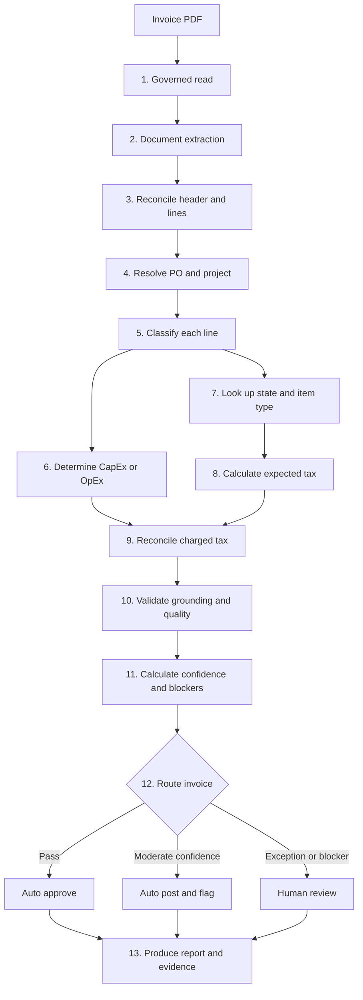

# Circle K Invoice Extraction and Taxability Determination

This document describes the end-to-end process implemented by
`examples/extract_invoice.py`. The workflow extracts a capital-project invoice, resolves its PO and
task context, determines capitalization and use-tax treatment per line, validates the result, and
routes exceptions to human review.

Microsoft Agent Framework and Azure AI provide extraction and reasoning. Autarch supplies
deterministic capability controls, governed reference reads, provenance, and audit evidence.

> The files in `examples/reference/` are proof-of-concept seed data. Production decisions must use
> approved Circle K PO, task, tax, jurisdiction-rate, and reviewed-history sources.

## Process Overview



## Authority Order

When sources disagree, the workflow uses this order of authority:

1. Facts printed on the current invoice.
2. Structured fields extracted by Azure Document Intelligence.
3. The matched and validated PO record.
4. The task master and its exact workbook item type and asset class.
5. The governed state-by-item-type taxability matrix.
6. Approved jurisdiction tax rates.
7. Reviewed historical decisions as supporting evidence only.
8. Model and embedding recommendations as classification evidence, not tax authority.

A filename, historical record, alternate identifier, or model suggestion must not override
contradictory facts printed on the invoice.

## Inputs

### Invoice

The source is normally a PDF containing:

- Vendor and invoice identifiers
- Invoice and PO dates
- Printed PO or AFE number
- Ship-to or service location
- Line descriptions, quantities, and amounts
- Vendor tax indicators
- Subtotal, charged tax, freight, and total
- Printed validation or project warnings

### Governed Reference Data

| File | Purpose |
|---|---|
| `examples/reference/seed-po-records.json` | Canonical PO, alternate IDs, vendor aliases, project, location, and primary task |
| `examples/reference/seed-task-codes.json` | Task item type, workbook asset class, capitalization eligibility, useful life, and depreciation |
| `examples/reference/seed-taxability-matrix-actual.json` | `state x exact item type` taxability verdict and available state rate |
| `examples/reference/seed-history.json` | Reviewed outcomes used as supporting precedent |

### Azure Services

| Service | Role |
|---|---|
| Azure Document Intelligence `prebuilt-invoice` | Structured fields, lines, OCR text, and extraction confidence |
| Azure OpenAI reasoning deployment | Extraction fallback, line classification, independent tax opinion, and evaluation panels |
| Azure OpenAI embedding deployment | Semantic comparison of descriptions with governed item types and tasks |
| Microsoft Entra ID | Passwordless authentication to Azure services |

## Step-by-Step Process

### 1. Parse the Run Configuration

The command-line application resolves the invoice path, reasoning model, authentication mode,
Document Intelligence endpoint, embedding model, confidence threshold, cache setting, and output
paths.

When an Azure model is explicitly requested but cannot be reached, processing stops instead of
silently substituting an offline model.

### 2. Read the Invoice Under Autarch Governance

Autarch creates an agent with a narrowly scoped `file.read` grant. Its deterministic capability
kernel denies any action without an explicit grant.

The read produces source text, a signed `why_id`, provenance evidence, and a guarantee showing that
the reader cannot write or delete the invoice. The original invoice remains unchanged.

### 3. Extract Structured Invoice Data

When `--doci` is enabled, Document Intelligence runs `prebuilt-invoice` and returns:

- Header fields
- Line items
- OCR content
- Page count
- Field confidence values
- Address evidence used to determine the governing state

Structured Document Intelligence values override duplicate free-form model values because they come
from a specialized extraction model.

If Document Intelligence is unavailable, the workflow falls back to the PDF text layer and then to
vision OCR for scanned or image-only invoices.

### 4. Reconcile Header Fields and Lines

The reasoning model extracts a complete header and candidate lines. The workflow reconciles those
values with Document Intelligence.

It checks:

- Structured lines versus model-extracted lines
- Sum of lines versus subtotal and total
- Subtotal incorrectly interpreted as charged tax
- Missing or duplicated lines
- Printed source warnings omitted by OCR
- Ship-to or service address versus bill-to address

If no shipping or service address establishes jurisdiction, the inferred state is retained as
evidence but creates a blocking warning.

### 5. Load Reference Data Under Read-Only Governance

The PO, task, matrix, and history files are loaded once by another Autarch agent with only
`file.read`. Signed reads are recorded, and the agent is proven unable to modify or delete the
governed files.

Missing reference data does not produce an invented rule. The affected determination remains
unresolved and is routed to review.

### 6. Resolve the PO and Project

The matcher compares the extracted invoice and PO numbers with `po_number`, `alt_po_numbers`, vendor
name, and vendor aliases. Identifiers receive the strongest weight; vendor identity corroborates the
match.

The workflow checks vendor, state, site, work description, task usage, PO budget, and multi-site or
multi-state conditions. A matching identifier with contradictory business facts creates a PO
discrepancy rather than silently accepting the record.

### 7. Classify Every Invoice Line

Every line is mapped to:

- One exact taxability-matrix item type
- One task code
- The task's workbook asset class
- CapEx or OpEx treatment
- Useful life and depreciation method
- Classification confidence and rationale

Classification combines:

1. Azure OpenAI reasoning
2. Deterministic PO-backed description rules
3. An embedding-based semantic cross-check

Known PO-backed materials, installation, repair, fixtures, freight, and consumables use existing
task records and exact matrix item types. The workflow does not manufacture an item type when the
workbook has no corresponding row.

If several semantic item types exceed the match score, separate candidates may be shown. Multiple
plausible mappings are explicitly routed to review.

### 8. Determine CapEx or OpEx

The task master is authoritative for capitalization eligibility. The workflow then applies
project-level and period-cost rules.

Current proof-of-concept rules include:

- Eligible project total must reach `$2,000` for capitalization.
- A project at or above `$100,000` is a major-project review blocker.
- Freight, travel, fuel surcharges, and similar period costs are expensed.
- Routine repairs, servicing, and consumables are expensed.
- A qualifying new asset or capitalizable installation may be capitalized.

A disagreement between the model's proposal and the deterministic result routes the line to review.

### 9. Determine Taxability From the Matrix

The deterministic tax-engine lookup is:

```text
matrix[service_or_ship_to_state][exact_item_type]
```

| Code | Meaning | Action |
|---|---|---|
| `T` | Taxable | Include the line in the taxable base |
| `E` | Exempt or not taxable | Exclude the line from the taxable base |
| `A` | Ambiguous | Require tax review |
| Missing | No governed rule | Require tax review |

The matrix verdict, not the model opinion, is the governing taxability result.

### 10. Obtain the Applicable Rate

The workflow retrieves the available rate for the governing state. When an approved local rate is
available, the effective rate may include state and local components.

When only a state base rate is available, the result is marked `state_base_only`. A taxable line
with an unresolved local rate remains an estimate and blocks automatic posting.

### 11. Calculate Expected Tax

Expected tax is calculated per taxable line:

$$
\text{Expected tax}_i = \text{Taxable line amount}_i \times \text{Applicable rate}_i
$$

The invoice expected tax is:

$$
\text{Expected invoice tax} = \sum_i \text{Expected tax}_i
$$

Exempt lines have expected tax of zero. Ambiguous or unmapped lines retain an unresolved value.

### 12. Perform Independent Tax Validation

Azure OpenAI separately assesses each line's taxability. This opinion does not replace the matrix.

- Agreement supports confidence.
- Divergence creates a tax exception.
- An ambiguous matrix result remains unresolved even if the model is confident.

This comparison can expose an incorrect item-type mapping or unusual invoice wording.

### 13. Reconcile Vendor-Charged Tax

Charged tax is allocated across report rows in proportion to line amounts.

$$
\text{Tax delta}_i = \text{Expected tax}_i - \text{Allocated charged tax}_i
$$

Potential additional use tax is:

$$
\text{Use tax to allocate}_i = \max(0, \text{Tax delta}_i)
$$

Vendor tax markers are preserved as evidence. A marker that conflicts with the matrix creates a
review exception.

### 14. Check Historical Precedent

Reviewed history is searched by vendor, exact item type, and state. The current invoice is excluded
from its own precedent search.

History supports confidence and reviewer context. It cannot override the invoice, PO discrepancy,
or governed matrix.

### 15. Validate Grounding, Quality, and Safety

The workflow performs:

- Source grounding checks for extracted fields
- Source citations
- Completeness and consistency checks
- Quality evaluation of line determinations
- Safety and prompt-injection checks
- Verification that the original read remained governed

Unsupported fields, failed evaluation panels, or blocking warnings force human review.

### 16. Calculate Confidence and Route the Invoice

The lowest line confidence becomes the starting invoice confidence. One unresolved line can prevent
automatic approval.

| Route | Condition |
|---|---|
| `AUTO_APPROVE` | Confidence meets the threshold and no hard blocker exists |
| `AUTO_POST_FLAGGED` | Confidence is at least `0.70` but below the configured threshold, with no blocker |
| `HUMAN_REVIEW` | Confidence is below `0.70`, or any hard blocker exists |

Hard blockers include:

- Ambiguous or missing taxability rule
- Unresolved local rate for a taxable line
- Tax-engine and model divergence
- Expected-versus-charged tax exception
- Vendor tax-marker conflict
- PO, vendor, state, site, task, or budget discrepancy
- Multiple semantic mappings
- Multiple jurisdictions requiring allocation
- Ungrounded extracted field
- Failed quality or safety evaluation
- Major-project threshold
- Blocking warning printed on the invoice
- Unconfirmed shipping or service jurisdiction

### 17. Produce Evidence and Outputs

The pipeline can produce:

- Console report
- Per-line CSV and rollup row
- Self-contained HTML report
- Full JSON result
- Signed Autarch provenance evidence
- Header-field citations
- PO and precedent evidence
- Per-line confidence, rationale, tax basis, and route
- Model token and usage totals

The CSV supports downstream analysis and SME triage. The HTML report supports review and audit.

### 18. Apply Optional Decision Caching

Azure OpenAI output can vary between runs. When caching is enabled, the first classification is
stored by:

```text
normalized vendor | ship-to state | normalized line description
```

Later runs restore that classification and independent model-tax opinion. Delete the cache to derive
decisions again. `--no-cache` reclassifies every line on the current run.

## Example Run

```powershell
python examples/extract_invoice.py `
  "C:\path\to\invoice.pdf" `
  --model azure:invoice-extractor `
  --auth aad `
  --doci "https://circlekdoci.cognitiveservices.azure.com/" `
  --embed azure:invoice-embeddings `
  --no-cache `
  --html "sandbox\_t\invoice_report.html" `
  --csv "sandbox\_t\invoice_lines.csv"
```

## Human Reviewer Checklist

For a `HUMAN_REVIEW` result:

1. Confirm the printed invoice and PO identifiers.
2. Confirm the ship-to or service address and governing state.
3. Confirm the matched PO, vendor, project, site, and task.
4. Confirm every line's exact workbook item type and asset class.
5. Resolve rows with multiple semantic matches.
6. Confirm the matrix verdict for the exact state and item type.
7. Obtain an approved local rate when only a state base rate is present.
8. Compare expected tax, charged tax, and proposed use tax.
9. Resolve warnings, PO discrepancies, and model/matrix divergence.
10. Record the approved outcome for future precedent.

## Implementation Map

| Concern | Implementation |
|---|---|
| CLI and top-level workflow | `examples/extract_invoice.py` |
| PO matching, fallbacks, matrix lookup, and semantic index | `examples/refdata.py` |
| Document Intelligence adapter | `examples/docintel.py` |
| Reproducible decision cache | `examples/decision_cache.py` |
| Autarch agent lifecycle | `autarch/agent.py` |
| Deterministic capability gate | `autarch/kernel.py` |
| Provenance and why-record storage | `autarch/memory.py`, `autarch/provenance.py` |
| Governed data | `examples/reference/` |

## Operational Limitations

- Seed PO and task records are incomplete and must be replaced by approved ERP data.
- The matrix may not contain every jurisdiction-specific exception.
- State base rates are insufficient where city, county, district, ZIP, or special rates apply.
- Semantic similarity is supporting evidence and may produce multiple candidates.
- Historical records are precedent, not tax authority.
- Human approval remains required for ambiguity, contradictory evidence, or missing governed data.