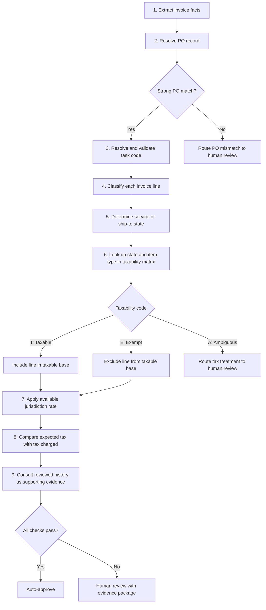

# Invoice Tax Determination Flow

Use invoice facts first and reference data second. A filename, alternate identifier, or historical record may suggest a match, but it must not override contradictory facts printed on the invoice.



## Lookup Sequence

```text
Invoice
  -> validated PO record
  -> validated task code
  -> line-item classification
  -> service/ship-to state
  -> taxability matrix code
  -> jurisdiction tax rate
  -> expected tax
  -> comparison with charged tax
  -> history-supported confidence
  -> auto-approval or human review
```

## Data Sources

| Order | Source | Purpose |
|---:|---|---|
| 1 | Invoice | Authoritative vendor, printed PO, state/site, line items, amounts, and tax charged |
| 2 | `testing/tax slabs/seed-po-records.json` | Resolve the canonical PO, project, task code, asset class, vendor, and location |
| 3 | `testing/tax slabs/seed-task-codes.json` | Resolve and validate the task description, capitalization, asset class, useful life, and depreciation |
| 4 | `testing/tax slabs/seed-taxability-matrix.json` | Map service state and item type to `T`, `E`, or `A`, and obtain the available base state rate |
| 5 | `testing/tax slabs/seed-history.json` | Find similar reviewed outcomes to support confidence; never override current invoice facts or matrix rules |

## PO Match Priority

1. Exact printed purchase order against `po_number`.
2. Exact printed purchase order against `alt_po_numbers`.
3. Confirm vendor or vendor alias.
4. Confirm service state and site.
5. Confirm that the PO description and asset class agree with the invoice work.

Reject or review a candidate when the identifier matches but the vendor, state, site, or work type materially conflicts.

## Taxability Lookup

Classify each invoice line into one supported matrix item type, then use:

```text
matrix[service_state][item_type]
```

The matrix codes mean:

- `T`: Taxable; include the line in the taxable base.
- `E`: Exempt; exclude the line from the taxable base.
- `A`: Ambiguous; require human review.

Get the available state rate with:

```text
tax_rates[service_state]
```

Calculate expected tax per line:

$$
\text{Expected tax} = \sum (\text{taxable line amount} \times \text{applicable rate})
$$

The seed matrix contains base state rates only. A complete determination may also require city, county, district, ZIP-level, product-specific, freight, and service rules.

## Review Conditions

Route the invoice to human review when any of these conditions applies:

- The printed PO has no reliable PO-record match.
- An alternate identifier matches but invoice facts contradict the candidate PO.
- The PO task code does not agree with the invoice work.
- A line cannot be classified reliably.
- The matrix returns `A`.
- The required local jurisdiction rate is unavailable.
- The invoice contains mixed taxable and exempt lines that cannot be separated.
- Expected and charged tax differ beyond the configured tolerance.
- Grounding or confidence checks fail.

## CBE Invoice Example

For `Cbe Capito - R3645629.pdf`:

```text
Invoice number: R3645629
Printed PO: 2543082
Service state: MO
Work: burglary alarm hardware and installation

Seed candidate found through alt_po_numbers: PO-CK-2025-3645
Candidate task: TC-6020, Interior Store Fixtures and Shelving
Candidate state/site: NC / 2847

Result: reject the candidate because the printed PO, state, site, and work type conflict.
Suggested semantic task: TC-5020, Security Camera and Access Control Systems
Hardware item type: IT & Electronics
Service item type: Professional Services
MO hardware matrix code: A
MO service matrix code: E
Final route: HUMAN_REVIEW
```
