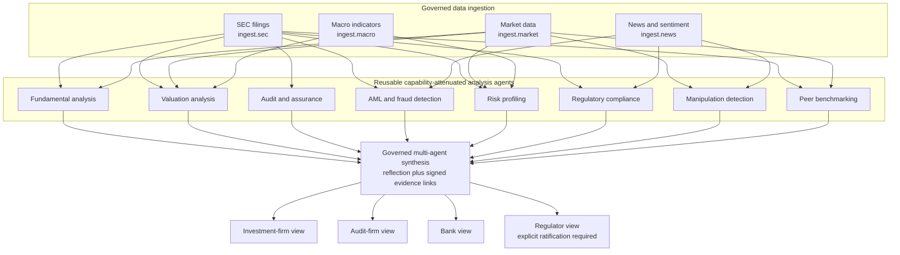

# Governed Finance Intelligence Example

The executable reference is [finance_intelligence.py](finance_intelligence.py). It uses deterministic offline fixtures so the entire architecture can be demonstrated without API keys. Each box below maps to a governed capability and every execution is written to one signed evidence chain.



## What the example proves

1. **Deny-by-default ingestion** — each source is a separate `ingest.*` capability.
2. **Real authority attenuation** — each specialist is spawned with only one `analysis.*` capability and one adapter.
3. **Deterministic analysis** — eight reusable components produce structured findings, metrics, and bounded confidence.
4. **Evaluated outputs** — deterministic quality checks are signed into specialist why-records.
5. **Evidence-linked synthesis** — the committee receives each specialist output together with its signed `why_id`.
6. **Audience separation** — four governed report capabilities produce views for investors, auditors, banks, and regulators.
7. **Accountable release** — policy requires explicit ratification for the regulator view.
8. **Static guarantees** — Autarch proves before execution that external publishing is unavailable and regulatory release cannot auto-execute.
9. **Economic control** — all seventeen actions share one bounded call/risk/cost budget.
10. **Tamper evidence** — the final hash chain is verified and exported as JSON Lines.

## Offline run

From the repository root:

```powershell
python examples/finance_intelligence.py
```

Generated files:

- `sandbox/finance_intelligence/outputs/finance_intelligence.html` — polished, responsive, print-ready executive dashboard
- `sandbox/finance_intelligence/outputs/finance_intelligence.json` — synthesis, tailored reports, budget, and guarantee results
- `sandbox/finance_intelligence/outputs/signed_audit.jsonl` — signed execution evidence
- `sandbox/finance_intelligence/outputs/ARCHITECTURE.txt` — portable text architecture map

## Moving to live data

Replace only the four ingestion callables:

| Offline capability | Suggested production source | Control recommendation |
|---|---|---|
| `ingest.sec` | SEC EDGAR APIs / normalized XBRL | Read-only, issuer and filing-type scope, immutable cache |
| `ingest.market` | Licensed market-data provider | Instrument scope, maximum lookback, as-of timestamp |
| `ingest.news` | Licensed news and sentiment feed | Source allowlist, injection scan, rights/retention policy |
| `ingest.macro` | FRED or central-bank API | Series allowlist, vintage date, reproducibility cache |

The specialists, synthesis, policies, budgets, consumer contracts, and evidence model do not need to change. Before production use, add licensed connectors, schema validation, source freshness SLAs, independent model evaluation, human approval workflows, security review, and jurisdiction-specific legal/compliance controls.

> This is an architecture demonstration, not investment, audit, tax, or legal advice.
