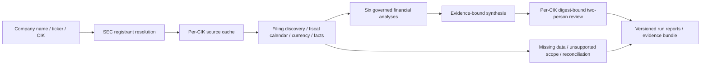

# Autarch Finance Intelligence: Microsoft Quarterly & Change Intelligence v1.1

## 1. Product definition

### Company selection extension

The shared [company finance entry point](company_finance_intelligence.py) accepts
`--company`, `--ticker`, or `--cik`. These options also work on the Microsoft entry
point, which routes selected companies to the general SEC US-GAAP financial profile.
Without a selector, the existing Microsoft-specific flow described below is unchanged.

The general profile detects fiscal calendars and currencies, keeps each registrant's
cache/reviews/runs in a CIK-specific workspace, and runs six general financial analyses.
It does not reuse Microsoft's company KPIs, valuation model, segment taxonomy, or
peer selection for other companies. It does not automatically discover or analyze
subsidiaries. Unsupported filings and unavailable facts are explicit coverage limits.
See the [README](../README.md#company-parameterized-financial-intelligence) for commands.



Autarch Finance Intelligence is a governed public-company diligence workspace. The Microsoft edition is a production-shaped **controlled pilot** using real public evidence rather than a fictional fixture:

- discover recent Microsoft Forms 10-K, 10-Q, and 8-K from SEC metadata;
- retrieve the latest and prior 10-K plus latest available 10-Q;
- URL-bind and retain each raw response in a content-addressed evidence cache;
- normalize annual, standalone-quarter, TTM, balance-sheet, and dimensional XBRL facts;
- retain selected-fact IDs, recast chains, formulas, and derivation inputs;
- reconcile four-quarter sums to filed annual facts;
- triage annual disclosure and event changes deterministically;
- add company-reported earnings KPIs, official macro series, indicative market history, and peer SEC facts;
- run fifteen narrowly authorized specialist analyses;
- evaluate every specialist's structure, caveats, questions, source references, and applicable fact links;
- synthesize only signed specialist evidence;
- bind semantic release content to a persistent named two-person review;
- produce role-specific views with explicit release state; and
- export verifiable action/review ledgers and a member-hashed evidence bundle.

The product is decision support. It does not provide investment, audit, tax, legal, credit, or regulatory advice. It does not trade, publish, approve an audit opinion, sign a tax position, or replace an accountable professional. It does not claim that this reference implementation alone satisfies every enterprise production control.

## 2. Buyer outcome

Traditional research workflows usually separate source collection, spreadsheet calculation, narrative drafting, review, and evidence retention. That fragmentation creates five recurring problems:

1. Conclusions become detached from source versions.
2. Calculations and narrative assumptions are difficult to reproduce.
3. Different teams repeat the same extraction and reconciliation work.
4. Review status is confused with analytical confidence.
5. A model or agent may possess more authority than its task requires.

This product packages the work as one governed record. A buyer receives:

- a responsive executive dashboard;
- a detailed portable analyst report;
- a machine-readable normalized package;
- a source manifest with URL, timestamp, authority class, size, and SHA-256;
- raw evidence files;
- specialist and synthesis why-record identifiers;
- a signed, tamper-evident execution ledger;
- methodology and architecture notes; and
- an evidence bundle suitable for controlled handoff.

## 3. Reference architecture

```mermaid
flowchart TB
    subgraph Public evidence
        SEC1[SEC submissions metadata]
        SEC2[SEC Company Facts XBRL]
        SEC3[Latest + prior Microsoft 10-K]
        SEC4[Latest available Microsoft 10-Q]
        IR[Microsoft earnings release]
        FRED[FRED macro series]
        MKT[Indicative market history]
        PEER[Peer SEC Company Facts]
    end

    subgraph Governed ingestion
        DISC[Dynamic filing discovery]
        CACHE[Content-addressed raw cache]
        NORM[Annual + quarterly + TTM normalization]
        LINEAGE[Selected facts + formulas + recasts]
        DELTA[Filing timeline + change triage]
        MAN[Source manifest]
    end

    subgraph Attenuated specialists
        FIN[Performance and leverage]
        QTR[Quarterly, TTM, and change intelligence]
        CHANGE[Filing-change detection]
        SEG[Segments and products]
        CASH[Cash flow and capital intensity]
        CREDIT[Liquidity and credit]
        CAP[Capital allocation]
        VAL[Valuation and reverse DCF]
        MKT2[Market and macro risk]
        COMP[Peer benchmarking]
        ACC[Accounting quality]
        AUD[Audit and controls]
        TAX[Tax exposure]
        AI[AI and cloud economics]
        RISK[Regulatory and operational risk]
    end

    SYN[Governed committee synthesis]
    IC[Investment committee]
    CFO[CFO and strategy]
    AC[Audit committee]
    CC[Credit committee]
    RR[Regulatory and enterprise risk]
    REVIEW[Digest-bound two-person review]
    VALIDATE[Fail-closed package acceptance gate]
    LEDGER[Signed why-ledger and evidence bundle]

    SEC1 --> DISC
    DISC --> SEC3
    DISC --> SEC4
    SEC2 --> CACHE
    SEC3 --> CACHE
    SEC4 --> CACHE
    IR --> CACHE
    FRED --> CACHE
    MKT --> CACHE
    PEER --> CACHE
    CACHE --> NORM
    NORM --> LINEAGE
    CACHE --> DELTA
    CACHE --> MAN
    NORM --> FIN & QTR & SEG & CASH & CREDIT & CAP & VAL & MKT2 & COMP & ACC & AUD & TAX & AI & RISK
    DELTA --> CHANGE
    FIN & QTR & CHANGE & SEG & CASH & CREDIT & CAP & VAL & MKT2 & COMP & ACC & AUD & TAX & AI & RISK --> SYN
    SYN --> IC & CFO & AC & CC & RR
    SYN --> REVIEW
    REVIEW --> VALIDATE
    LINEAGE --> VALIDATE
    MAN --> LEDGER
    SYN --> LEDGER
    REVIEW --> LEDGER
    VALIDATE --> LEDGER
```



### Core design rule

Intelligence proposes or analyzes. The Autarch kernel governs consequences.

A specialist receives only the capability and adapter required for its analysis. It does not inherit source-ingestion, publication, trading, or unrelated specialist authority merely because it participates in the workflow.

## 4. Evidence hierarchy

The source manifest does not flatten all data into one undifferentiated truth class.

| Evidence class | Examples | Intended use | Important limitation |
|---|---|---|---|
| Filed annual report and audited financial statements | Latest Form 10-K | Canonical annual financial statements, footnotes, audit report, risks | Public disclosure is historical and may contain estimates |
| Filed interim report and unaudited financial statements | Latest available Form 10-Q | Interim context and filing-sequence review | Unaudited, seasonal, and may contain cumulative cash-flow facts |
| Regulatory XBRL facts | SEC Company Facts | Standardized consolidated and peer calculations | Taxonomy tags and issuer practices change over time |
| Company-reported earnings release | Microsoft Investor Relations | Recent operating KPIs such as Azure growth, Copilot seats, and commercial RPO | Operating metrics may be unaudited and definitions can change |
| Official macroeconomic series | FRED | Rates, inflation, GDP, and credit-spread context | Publication lags and revisions differ by series |
| Indicative market data | Public chart endpoint | Demonstration price history, beta, volatility, and momentum | Not an entitled production market-data feed |

SEC financial facts are canonical for annual GAAP values. Earnings-release annual figures are reconciled against SEC values rather than silently substituted. Market-sensitive decisions require an approved licensed feed.

## 5. Reproducible ingestion

### 5.1 Dynamic filing discovery

The connector retrieves the Microsoft submissions object for CIK `0000789019`, builds a recent 10-K/10-Q/8-K timeline, selects the newest and prior annual filings plus the latest available interim filing, and constructs SEC archive URLs from accession and primary-document metadata.

This avoids a brittle hard-coded annual-report URL and correctly follows a newly filed 10-K even if an investor-relations landing page has not been updated.

### 5.2 Content-addressed cache

Each source response is stored under a file name containing the first 16 hexadecimal characters of its SHA-256 digest. The cache index records:

- source ID;
- provider;
- description;
- evidence class;
- public URL;
- HTTP status and content type;
- retrieval timestamp;
- ETag and Last-Modified values when supplied;
- complete SHA-256;
- byte count; and
- relative cache path.

A cache replay recalculates the content hash before returning bytes. A modified or missing file is rejected.
The cache also requires the stored URL to match the requested URL. A stable source ID therefore cannot silently replay bytes from an older accession after filing discovery moves forward.

### 5.3 Retrieval modes

| Mode | Behavior | Typical use |
|---|---|---|
| `live` | Fetch every source and update the cache index | Fresh demonstration or scheduled production ingestion |
| `hybrid` | Use fresh cache entries, refresh expired entries, and fall back to a valid stale entry on a network error | Normal analyst workflow |
| `cache-only` | Make no network request and require every source object to pass hash validation | Reproduction, controlled review, tests, and offline demonstration |

The raw cache is not deleted when generated reports are refreshed. Generated outputs and Autarch execution state are rebuilt separately.

## 6. Normalization contracts

### 6.1 Consolidated annual facts

The normalizer supports taxonomy aliases and combines facts across aliases. For each fiscal-period end it prefers:

1. a Form 10-K annual duration;
2. the newest filing/recast; and
3. the higher-priority concept when filing metadata ties.

Metrics include revenue, gross profit, operating income, net income, pretax income, tax expense, CFO, capex, dividends, repurchases, stock compensation, R&D, cash taxes, interest, other income/expense, EPS, and diluted shares.

### 6.2 Balance-sheet facts

For Microsoft, instant facts are restricted to the June 30 fiscal year-end. Current and historical aliases are merged. Metrics include liquidity, receivables, current assets and liabilities, debt, equity, PP&E, goodwill, intangibles, deferred revenue, lease liabilities, uncertain tax benefits, shares outstanding, and remaining performance obligations.

### 6.3 Quarterly and TTM facts

Fiscal quarters are identified from their actual duration dates and Microsoft's June year-end—not from the reported `fy` field alone, because SEC Company Facts can repeat historical periods in later filings.

The construction policy is fail closed:

1. Prefer a direct 70–120-day quarter-duration fact.
2. Derive Q2 only as filed six-month YTD less filed Q1 when no direct Q2 exists.
3. Derive Q3 only as filed nine-month YTD less filed six-month YTD when no direct Q3 exists.
4. Derive Q4 only as filed annual less filed nine-month YTD when no direct Q4 exists.
5. Sum four consecutive fiscal quarters for each TTM observation.
6. Reconcile available four-quarter sums to their selected annual facts within a documented numerical tolerance.

Derived records retain a deterministic formula and complete input fact IDs. No missing quarter is interpolated or silently annualized.

### 6.4 Dimensional inline-XBRL facts

The latest filing's XBRL contexts are mapped to Microsoft segment and product members. Annual duration contexts are retained for:

- Productivity and Business Processes;
- Intelligent Cloud;
- More Personal Computing;
- Server products and cloud services;
- Microsoft 365 Commercial and Consumer;
- Gaming;
- LinkedIn;
- Windows and Devices;
- Search advertising;
- Dynamics;
- Enterprise and partner services; and
- Other.

The parser retains reported values and performs no allocation beyond the issuer's dimensional facts. v1.1 also assigns stable selected-fact IDs to segment and product values and retains context, member, source, filing, and duplicate-observation metadata.

### 6.5 Selected-fact inventory

Each selected or calculated record has a full SHA-256-derived fact ID and records, where applicable:

- metric, entity/member, period, namespace, concept, unit, and normalized value;
- filing date, accession, form, and source object;
- deterministic selection method;
- every observed recast/duplicate candidate and the selected candidate;
- formula and exact input IDs for calculated records; and
- whether a value changed across its observed recast chain.

Source inputs used by a derived record are indexed alongside top-level selected facts, so all in-report derivation links resolve.

### 6.6 Qualitative filing evidence

Visible 10-K text is used for deterministic detection of:

- audit opinions and auditor;
- critical audit matters;
- management's ICFR conclusion;
- Microsoft Cloud gross margin;
- AI infrastructure margin pressure;
- datacenter, energy, and GPU constraints;
- the IRS notice of proposed adjustment;
- transfer-pricing and global minimum-tax discussion; and
- filing-supported risk topics.

Keyword detection establishes that a topic is present. It does not infer probability, severity, or legal outcome.

The latest and prior annual disclosure objects are compared for deterministic topic-hit and extracted-attribute movement. This is triage only—not a paragraph redline, materiality determination, or legal conclusion.

## 7. Specialist workbench

| Specialist | Primary evidence | Core outputs | Required professional challenge |
|---|---|---|---|
| Financial performance | SEC consolidated XBRL | growth, margins, operating leverage, ROE | durability, mix, and normalization |
| Quarterly and change intelligence | SEC Company Facts and filing sequence | standalone quarters, YoY/sequential change, TTM, reconciliation | seasonality, cumulative derivations, recasts |
| Filing-change detection | Latest/prior 10-K and filing timeline | deterministic topic/attribute deltas and recent events | professional redline and materiality assessment |
| Segment economics | Inline XBRL, IR KPIs | segment/product growth, mix, and margin | shared-cost allocation and recasts |
| Cash flow and capital intensity | SEC cash flow and balance sheet | CFO, capex, FCF, PP&E growth, SBC lens | growth versus maintenance capex |
| Balance sheet and credit | SEC balance sheet | liquidity, funded debt, leases, coverage, RPO | purchase commitments and stress timing |
| Capital allocation | SEC cash flow and expense facts | R&D, capex, distributions, repurchases net of SBC | incremental return thresholds |
| Valuation scenarios | SEC, market, FRED | multiples, DCF cases, reverse DCF | growth, discount, terminal, and capex assumptions |
| Market and macro risk | Market history, FRED | return, volatility, drawdown, beta, rates, inflation | short sample and non-stationarity |
| Peer benchmarking | Peer SEC XBRL | growth, margins, FCF margin, capex intensity | fiscal calendar and business-mix comparability |
| Accounting quality | SEC and IR reconciliation | cash conversion, accruals, DSO, deferred revenue, investment marks | useful lives, receivables, and normalization |
| Audit and controls | Auditor and management reports | audit/ICFR opinions and CAMs | reasonable versus absolute assurance |
| Tax exposure | SEC tax facts and footnotes | effective/cash rates, reserves, IRS controversy | probability-weighted outcomes and law change |
| AI and cloud economics | IR KPIs, SEC filing | Azure, Copilot, RPO, capex, PP&E, cloud margin | utilization and fully loaded return on capital |
| Regulatory and operational risk | 10-K risk disclosures | explicit risk register | likelihood and impact are analyst judgments |

Every specialist output includes:

- component and professional title;
- verdict and narrative summary;
- bounded confidence;
- explicit label that confidence is uncalibrated and not a probability;
- structured metrics;
- at least three findings;
- finding type (`reported`, `calculated`, `model inference`, `methodology`, or `analyst inference`);
- severity;
- source references;
- direct selected-fact IDs when a finding is designated as a normalized structured-fact claim;
- caveats;
- diligence questions;
- optional tables; and
- model assumptions where applicable.

## 8. Calculation policy

### Free cash flow

The demonstration defines conventional free cash flow as:

\[
\text{FCF}=\text{cash from operations}-\text{capital expenditures}
\]

It is a non-GAAP analytical measure. It does not distinguish growth from maintenance capex.

An ownership-economics lens also displays:

\[
\text{FCF after SBC}=\text{CFO}-\text{capex}-\text{stock compensation}
\]

That lens is not a GAAP measure and does not imply that expense and repurchase cash are directly interchangeable.

### DCF

The scenario model uses five explicit annual periods and a Gordon-growth terminal value:

\[
V_0=\sum_{t=1}^{5}\frac{FCF_0(1+g)^t}{(1+r)^t}
+\frac{FCF_5(1+g_T)}{(r-g_T)(1+r)^5}
+\text{net cash}
\]

Per-share value divides by reported shares outstanding. Starting FCF is the average of the latest two fiscal years' CFO less capex. The reverse DCF solves for the constant five-year growth rate that equates the model value to the indicative market price.

The DCF is a sensitivity framework, not a forecast or price target. The browser's interactive valuation controls are explicitly unsigned and do not alter the governed evidence package.

### Market statistics

Daily adjusted-price observations are used for the one-year return, realized volatility, maximum drawdown, moving averages, covariance beta, and correlation. These historical statistics are not predictive and do not replace a licensed price or risk system.

### Peer comparison

Peer metrics use each issuer's latest available annual Form 10-K period. No calendarization, consensus forecast, segment remapping, or lease normalization is performed. That makes the table suitable for directional operating comparison—not transaction, target-price, or relative-valuation conclusions.

## 9. Governance and authority model

### 9.1 Capabilities

- ingestion agents receive one `ingest.<source>` capability;
- specialists receive one `analysis.<component>` capability;
- the committee receives only `synthesis.committee`;
- each consumer receives one `consumer.<persona>` capability;
- no participant receives a trading or external-publication capability.

### 9.2 Static guarantees

Before data ingestion, the parent proves:

- `external.publish` is forbidden;
- `trade.execute` is forbidden; and
- any `external.publish` action cannot execute without approval (and is denied in this product).

### 9.3 Runtime policy and release review

Runtime policy denies external publication and all `trade.*` actions. No specialist or consumer is auto-ratified. After semantic content is assembled, the product computes SHA-256 over canonical release JSON containing source hashes and URLs, selected fact IDs, specialist outputs, stable synthesis, and stable persona content. Volatile generation/access timestamps and review state are excluded.

The durable SQLite/WAL review store requires both `finance-review-lead` and `risk-review-lead`, with quorum two and a 30-day TTL. It supports pending, approved, rejected, expired, and superseded states; immutable votes/comments; and a verifiable event hash chain. Changed semantic content produces a new digest and supersedes any active decision for the same release key. Approval authorizes only the matching digest; it does not itself publish or trade.

Reviewer strings supplied by the reference CLI are attribution only. A deployed service must inject identities authenticated by an enterprise IdP. After a review decision, regenerate the artifacts so reports reflect current review state.

### 9.4 Shared budget

The parent and children share one economic envelope. The reference run allows 36 calls, 120 risk units, and two cost units. A request that would exceed the envelope is refused before adapter execution.

### 9.5 Evaluation

A specialist cannot enter synthesis unless deterministic assertions confirm:

- a structured component and title;
- confidence in the interval from zero to one;
- at least three substantive findings;
- caveats;
- professional diligence questions; and
- component and finding source IDs that all resolve in the run's source manifest;
- fact IDs that resolve in the selected-fact inventory; and
- a non-empty fact-ID set for every finding explicitly designated as a structured-fact claim.

### 9.6 Signed lineage

Each successful ingest, analysis, synthesis, and persona view creates a why-record. Specialist why-record IDs are passed directly into synthesis. The final ledger is exported and its hash chain is verified before the output package is declared complete.

Before rendering, a fail-closed package gate validates the ordered 15-specialist and five-audience contracts, source hashes, component/finding references, fact inventory and links, applicable claim coverage, quarter reconciliation, canonical release digest, review content binding, authorization consistency, expected 26-action ledger count, both hash chains, and static guarantees.

## 10. Product outputs

A successful run writes the following under `sandbox/microsoft_finance_intelligence/outputs/`:

| Artifact | Purpose |
|---|---|
| `microsoft_finance_intelligence.html` | Responsive product dashboard, interactive filters, and unsigned DCF laboratory |
| `microsoft_finance_intelligence.md` | Detailed portable professional-review report |
| `microsoft_finance_intelligence.json` | Complete normalized source, analysis, synthesis, persona, and governance package |
| `evidence_manifest.json` | Compact source-to-ingestion and component-to-why-record index |
| `signed_audit.jsonl` | Tamper-evident Autarch execution ledger |
| `review_audit.json` | Persistent review requests, votes/comments, and verifiable event chain |
| `artifact_manifest.json` | Byte size and SHA-256 for generated deliverables |
| `METHODOLOGY.txt` | Portable method summary |
| `ARCHITECTURE.txt` | Portable text architecture map |
| `microsoft_evidence_bundle.zip` | Reports, manifests, both ledgers, methods, raw evidence, and member-level hash manifest |

The HTML dashboard includes:

- executive bull/base/bear cases;
- explicit thesis-strengthening and thesis-break triggers;
- five-year financial and capital-intensity views;
- segment and offering economics;
- Azure, Copilot, RPO, and AI-capacity analysis;
- DCF, reverse DCF, multiples, and an interactive sensitivity lab;
- market and macro context;
- peer operating benchmarks;
- quarterly and TTM charts, tables, and annual reconciliation results;
- annual disclosure-change triage and a recent filing timeline;
- fifteen searchable specialist records;
- searchable selected-fact, recast, and formula drill-down with claim links;
- evidence-quality dimensions separated from uncalibrated analytical confidence;
- exact digest-bound named-review state;
- an explicit risk register;
- five buyer-persona views;
- source URLs and hashes;
- signed specialist why-records;
- static guarantees and budget state; and
- methodology, limitations, downloads, and review requirements.

## 11. Running the reference product

Use a descriptive SEC-compliant user agent containing an organizational identity and contact channel.

```powershell
$env:SEC_USER_AGENT = "YourOrganization research-contact@example.com"
python examples/microsoft_finance_intelligence.py --mode live
```

Normal analyst operation:

```powershell
python examples/microsoft_finance_intelligence.py --mode hybrid
```

Reproduce exactly from the retained cache:

```powershell
python examples/microsoft_finance_intelligence.py --mode cache-only
```

Operate review state independently:

```powershell
python examples/microsoft_finance_review.py list
python examples/microsoft_finance_review.py status <review-id>
python examples/microsoft_finance_review.py comment <review-id> --reviewer finance-review-lead --comment "Tie-out complete"
python examples/microsoft_finance_review.py approve <review-id> --reviewer finance-review-lead --comment "Financial review complete"
python examples/microsoft_finance_review.py approve <review-id> --reviewer risk-review-lead --comment "Risk review complete"
python examples/microsoft_finance_review.py verify
```

Use `--cache-ttl-hours` to change hybrid freshness. Use `--user-agent` to supply the SEC identity without an environment variable.

The implementation uses the Python standard library and Autarch itself. It requires no API key. A commercial deployment should replace the indicative market endpoint with an entitled provider and should apply the organization's approved retention and licensing policy to the evidence bundle.

## 12. Go-to-market packaging

### Investment research and asset owners

**Problem:** analysts spend significant time reconciling filings, operating KPIs, capital intensity, valuation assumptions, and review notes.

**Product outcome:** a reproducible company workspace with quarterly/TTM change detection, explicit embedded-expectation analysis, and thesis-break monitoring.

**Proof in this edition:** the product links cloud demand signals to capex, PP&E, FCF, rates, valuation, and a source-level chain rather than presenting AI growth in isolation.

### CFO and corporate strategy

**Problem:** internal strategy teams need external benchmarks without inheriting opaque sell-side models.

**Product outcome:** transparent segment, product, peer, capital-allocation, and infrastructure-productivity analysis that can be adapted to internal governed data.

### Audit and assurance

**Problem:** narrative summaries often lose the distinction among audited facts, management KPIs, calculations, and model inferences.

**Product outcome:** labeled evidence classes, CAM and ICFR extraction, accounting-quality diagnostics, review questions, and signed execution lineage.

### Credit and banking

**Problem:** headline net cash can obscure leases, fixed build commitments, capital intensity, and stress timing.

**Product outcome:** lease-adjusted obligation visibility, coverage, RPO context, macro conditions, and cash-flow stress questions.

### Regulatory, compliance, and enterprise risk

**Problem:** risk inventories are frequently detached from the filing text and from accountable release controls.

**Product outcome:** filing-supported topic detection, analyst-labeled impact/likelihood, source references, static authority constraints, and a digest-bound role-specific review workflow.

## 13. Production hardening path

The reference implementation proves the workflow pattern, not every enterprise control. Production adoption should add:

1. **Identity and approval:** authenticated IdP principals, role separation, non-repudiation appropriate to the buyer, and time-bound approval tokens. CLI-entered names are not authentication.
2. **Data entitlements:** licensed real-time and historical market data, permitted redistribution, and provider-level lineage.
3. **Orchestration:** scheduled ingestion, retries, back-pressure, idempotent run IDs, and alerting.
4. **Storage:** immutable/WORM evidence tiers, retention schedules, encryption, jurisdiction controls, and legal hold.
5. **Schema governance:** versioned mappings, observed taxonomy drift, reconciliation tolerances, and parser regression fixtures.
6. **Model governance:** approved assumption sets, scenario ownership, validation, challenger models, and model-risk inventory.
7. **Analyst workflow:** comments, exceptions, review queues, sign-off, artifact regeneration after decisions, supersession, and post-publication correction.
8. **Security:** secret management, egress allowlists, malware scanning, dependency controls, and least-privilege service identities.
9. **Observability:** service-level objectives, source freshness alerts, lineage gaps, policy refusals, budget events, and evidence-chain verification.
10. **Legal and compliance:** jurisdiction-specific advice boundaries, accessibility, privacy, records policy, and disclosures.

## 14. Acceptance criteria

A production candidate should not pass release unless:

- the latest filing is dynamically resolved and reconciled;
- every source file passes its stored SHA-256;
- cached source IDs remain bound to requested URLs;
- every available four-quarter sum reconciles to its selected annual fact within documented tolerance;
- every derived quarter and TTM fact retains a formula and resolvable inputs;
- dimensional totals reconcile or explain differences;
- company-reported KPIs are labeled and definition changes are detected;
- market data comes from an approved entitled source;
- every finding has at least one resolvable source reference;
- every designated structured-fact claim has resolvable selected-fact IDs;
- every model output discloses assumptions and sensitivity;
- all specialist assertions pass;
- the fail-closed package acceptance gate passes;
- professional views have digest-matched, authenticated owner state;
- forbidden trade and publication paths remain ungranted and denied;
- the signed execution chain verifies; and
- a human reviewer confirms fitness for the intended decision.

## 15. What this example deliberately does not claim

- It does not claim that public data is complete or error-free.
- It does not infer private customer cohorts, contract economics, capacity utilization, or management forecasts.
- It does not treat RPO as cash, revenue, or profit.
- It does not label a clean audit opinion as fraud-proof.
- It does not label an IRS proposed adjustment as an expected loss.
- It does not treat a deterministic confidence score as a probability of investment success.
- It does not use historical beta or volatility as a complete risk model.
- It does not issue a target price or recommendation to buy, sell, lend, audit, certify, or file.
- It does not permit the agent system to publish or execute a trade.
- It does not treat CLI reviewer names as authenticated identities.
- It does not claim a hash chain prevents an authorized database administrator from rewriting both records and hashes; deployment controls must protect storage and keys.

The commercial proposition is therefore not “an autonomous analyst that replaces accountability.” It is a governed evidence and decision-intelligence system that makes automated work inspectable, reproducible, constrained, and reviewable by accountable professionals.
